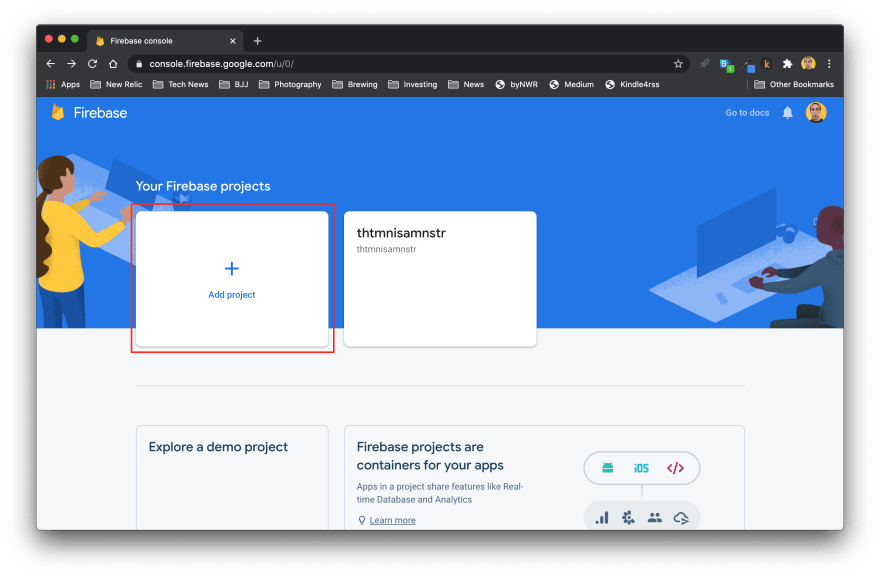
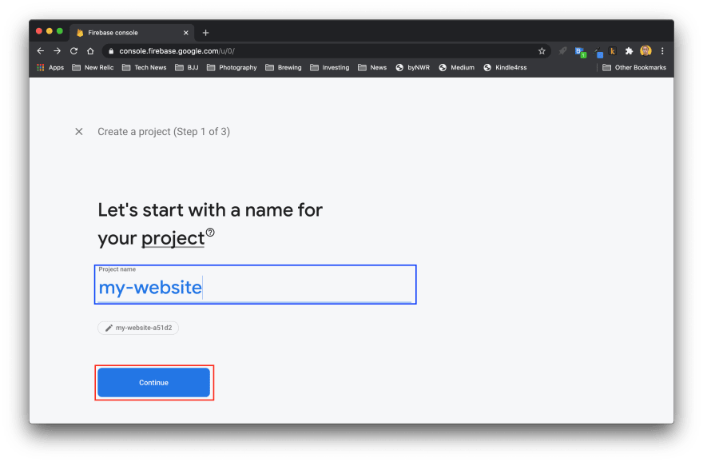
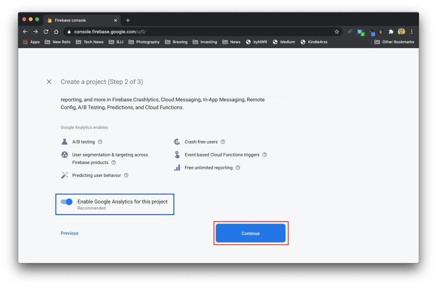
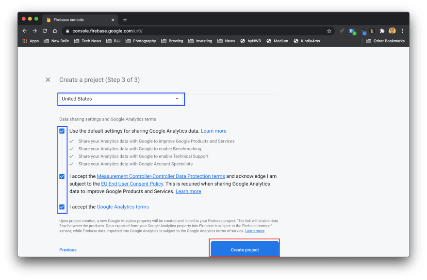
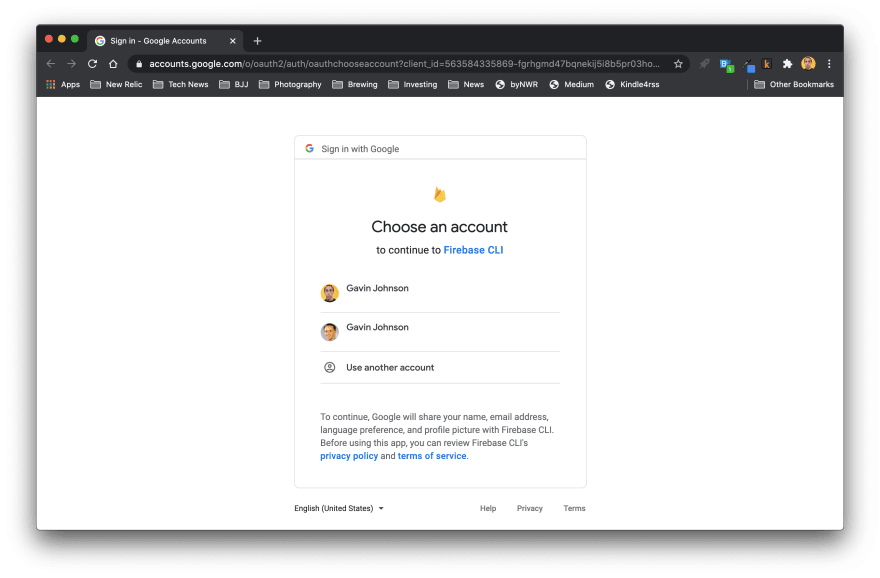
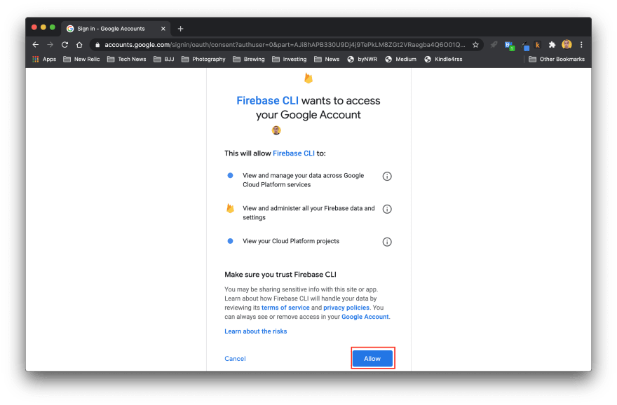
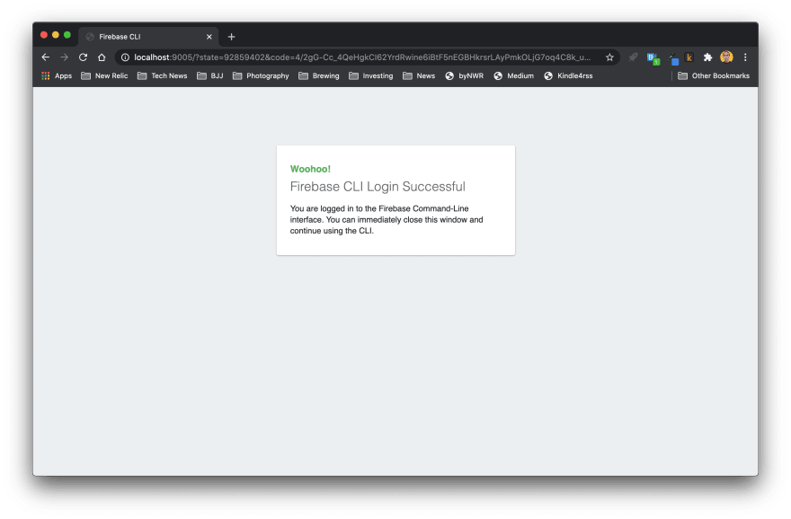

***This post is the third in a series and was originally published on [Dev.to](https://dev.to/thtmnisamnstr/building-a-portfolio-resume-site-with-gatsby-part-3-deploying-to-firebase-2a19).***
<br />

Quick recap. My personal website sucks. I'm updating it using [Gatsby](https://www.gatsbyjs.org) and the [Novela theme](https://github.com/narative/gatsby-theme-novela) by narative, because it's popular, and I'm basic.

* **[GitHub Repo for this website](https://github.com/thtmnisamnstr/thtmnisamnstr-dotcom)**
* **[My personal website](https://thtmnisamnstr.com)**

*FYI, I'm using a Mac, so there may be some Mac-specific commands.*
<br/>
Alright, part 3, deploying is the fun part. That’s when your site actually ends up on the internet. Like... people can visit it and stuff. It’s not just a project on your computer anymore. So let’s get into it..

## Initialize Firebase on your site and deploy to Firebase
* Login to [Firebase](https://firebase.google.com) and create a project for you site. Make an account if you don’t already have one.
  * Click Go to Console

  * Click the Add Project tile

  * Give your project a name and click Continue

  * Enable Google Analytics for your site (or not, your choice) and click Continue

  * Select your Google Analytics location, configure your Google Analytics settings, accept both terms checkboxes, and click Create Project

* Install the Firebase CLI and initialize your site's directory
  * In terminal, `npm install -g firebase-tools`
  * `firebase logout` *(you may not have to do this step, but I did)*
  * `firebase login`

  * Type 'y' to let Firebase collect usage and error reporting info. Type 'n' not to *(I go with 'n')* and press Enter
  * This will open up a Google sign-in page

  * Select your Google account that you use for Firebase
  * You will be asked to authorize Firebase CLI to access your Google account. Click the Allow button.

  * You should get a login successful screen *(you can close this window)*

  * In Terminal, the output should be something like `✔  Success! Logged in as [your.email]@gmail.com`
  * `cd` to your site's root directory
  * `firebase init`

  * Press the down arrow until the "Hosting: ..." option is highlighted, press the space bar to select it, and press Enter

  * Use the up and down arrows to highlight "Use an existing project" and press Enter

  * Select the Firebase project you created previously and press Enter
  * For public directory, type 'public' and press Enter
  * For whether to configure as a single-page app, type 'n' and press Enter

  * If asked to overwrite anything, type 'n' and press Enter
  * Your terminal output should be:

```
i  Skipping write of public/index.html

i  Writing configuration info to firebase.json...
i  Writing project information to .firebaserc...

✔  Firebase initialization complete!
```

* Commit your changes to your repo
  * `git add --all`
  * `git commit -a -m "Initialized Firebase"`
  * `git push -u origin main`

*That's right we committed right to main. Didn't fork and do a PR. You don't have to. I usually do, but didn't this time. It's a good habit to fork and PR though.*

* Deploy your site to Firebase (when your site is ready to deploy)
  * `gatsby clean`
  * `gatsby build`
  * `firebase deploy --only hosting`
  * Your terminal output should be like the following...

```
=== Deploying to 'thtmnisamnstr'...

i  deploying hosting
i  hosting[thtmnisamnstr]: beginning deploy...
i  hosting[thtmnisamnstr]: found 135 files in public
✔  hosting[thtmnisamnstr]: file upload complete
i  hosting[thtmnisamnstr]: finalizing version...
✔  hosting[thtmnisamnstr]: version finalized
i  hosting[thtmnisamnstr]: releasing new version...
✔  hosting[thtmnisamnstr]: release complete

✔  Deploy complete!

Project Console: https://console.firebase.google.com/project/thtmnisamnstr/overview
Hosting URL: https://thtmnisamnstr.web.app
```

**Boom!** You're site is deployed to Firebase. You should be able to go to the Hosting URL in your most recent terminal output to see your site. I already had my Firebase configured for [thatmanisamnstr.com](https://thtmnisamnstr.com). So when I go there, it's up.


**That's it for today.**
*I'll post a tutorial next week on how to automate deployments with GitHub Actions. That was supposed to be part of this post, but I’ve been crazy busy at work (I ran go-to-market for [open sourcing our instrumentation](https://blog.newrelic.com/product-news/introducing-open-source-agents-and-projects/), and I ended up doing a bunch of work [for our recent launch](https://blog.newrelic.com/product-news/new-relic-one-observability-made-simple/). [Our new free tier](https://dev.to/newrelic/how-to-sign-up-for-new-relic-s-new-perpetual-free-tier-1ebn) is dope btw.).*