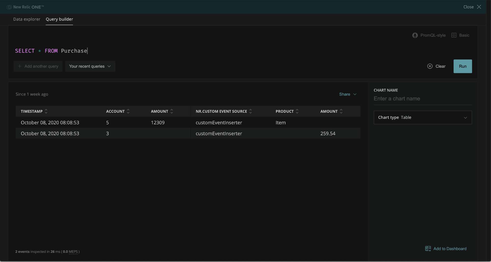
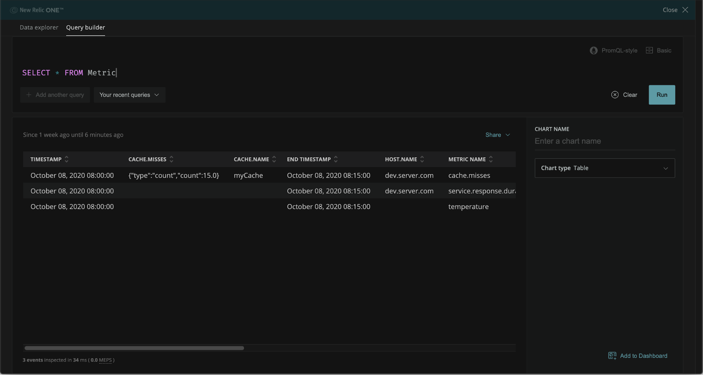

***This post was originally published on [Confluent's blog](https://www.confluent.io/blog/kafka-connect-for-new-relic/) as part of a small go-to-market for the Kafka Connector for New Relic. It was republished on the [New Relic blog](https://blog.newrelic.com/product-news/kafka-connect-for-new-relic/). I co-wrote this post with Rahul Bhattacharya from Confluent.***
<br />

It’s 3:00 am and PagerDuty keeps firing you alerts about your application being down. You need to figure out what the issue is, if it’s impacting users, and resolve it quickly so your users aren’t interrupted and you can get back to sleep. A lot of people rely on [New Relic](https://newrelic.com) to help with this.

Traditionally, the telemetry data that is stored in New Relic’s [Telemetry Data Platform](https://newrelic.com/platform/telemetry-data-platform) has come from New Relic’s own instrumentation. More and more, that isn’t the case, with open source tools and alternative instrumentation sending data to the Telemetry Data Platform. Now, it’s easier than ever to build these observability pipelines with the New Relic connector for Kafka Connect, available both on the [Confluent Hub](https://www.confluent.io/hub/newrelic/newrelic-kafka-connector) and open source on [GitHub](https://github.com/newrelic/kafka-connect-newrelic).

The below tutorial details how to set up the connector for both events and metrics and provides simplified examples of sending data in both data types to New Relic through the connector.
New Relic without Kafka Connect


## New Relic Connector for Kafka Connect
The New Relic connector for Kafka Connect allows you to ingest data from Apache Kafka® topics into the New Relic platform without writing a single line of code. Because we’re working with Kafka Connect, the connector is purely driven by configuration, which you apply using the Kafka Connect REST API. Things like retries, error handling, and dead letter queues are handled for you by Kafka Connect and can be customized as required. Achieving this with a Kafka consumer would require many hours of development time and testing.

Currently, the connector supports the [Metric](https://docs.newrelic.com/docs/telemetry-data-platform/get-data/apis/introduction-metric-api) and [Event](https://docs.newrelic.com/docs/telemetry-data-platform/ingest-manage-data/ingest-apis/use-event-api-report-custom-events) telemetry data types. We are working on releasing code for the remaining data types (Log and Trace) soon.

To get started, head over to [Confluent Hub](https://www.confluent.io/hub/newrelic/newrelic-kafka-connector) and follow the instructions to install the connector into your local Kafka cluster. After that, you can use the [Kafka Connect REST API](https://docs.confluent.io/current/connect/references/restapi.html?&_ga=2.148221751.1248744156.1603040520-1928848811.1603040520#post--connectors) to launch a connector. This will require an [API key from New Relic](https://docs.newrelic.com/docs/telemetry-data-platform/ingest-manage-data/ingest-apis/use-event-api-report-custom-events#) to start sending data.

The connector takes care of all the error handling for you—if messages do not follow the recommended format, you can pipe them to a dead letter queue (DLQ) and also decide whether you want to abort processing if a bad message is read, or continue regardless. This [blog post](https://www.confluent.io/blog/kafka-connect-deep-dive-error-handling-dead-letter-queues/) explains these options in more detail.

Runtime errors like connectivity issues, the wrong API key, or too large of payload are handled in different ways:
* The wrong API key will shut down the connector task immediately.
* If there is a network error, the connector will retry up to a user-configured limit.
* If the payload is too large, the connector splits and retries until it sends everything over. From a user perspective, you don’t need to worry about this.

Let’s look now in more detail at how to set up an Event or Metric connector.

## Events
The [Event API](https://docs.newrelic.com/docs/telemetry-data-platform/ingest-manage-data/ingest-apis/use-event-api-report-custom-events) is supported by New Relic. To create an Event connector, you can use the sample JSON to configure the connector in Kafka Connect:

```
{
 "name": "events-connector",
 "config": {
 "connector.class": "com.newrelic.telemetry.events.TelemetryEventsSinkConnector",
 "value.converter": "com.newrelic.telemetry.events.EventsConverter",
 "topics": "nrevents",
 "api.key": ""
 }
}
```

The above JSON will create a connector with the name `events-connector`. It will start sinking messages from a topic called `nrevents`. A sample Event message looks something like this (note that the timestamp field in the payload needs to be the Unix epoch in milliseconds):

```
[
  {
    "eventType":"Purchase",
    "account":3,
    "Amount":259.54,
    "timestamp":<CURRENT_TIMESTAMP>
  },
  {
    "eventType":"Purchase",
    "account":5,
    "amount":12309,
    "product":"Item",
    "timestamp":<CURRENT_TIMESTAMP>	
  }
]
```

The above message creates two events in New Relic of the type `Purchase`. **Make sure you use the current timestamp.** You can list them in New Relic One’s [Query Builder](https://docs.newrelic.com/docs/query-your-data/explore-query-data/query-builder/introduction-query-builder) by running a query like `SELECT * from Purchase`.



Your messages in the topic should adhere to this format. For an event, `eventType` and `timestamp` are required fields.The `EventsConverter` is responsible for validating these messages and will flag them as errors if they do not comply with the required format.

## Metrics
The details of the Metric API can be found in the [documentation](https://docs.newrelic.com/docs/telemetry-data-platform/get-data/apis/introduction-metric-api). Metrics are broadly classified into the three following categories:
1. **Gauge:** Examples include temperature, CPU usage, and memory.
2. **Count:** Examples include cache hits per reporting interval and the number of threads created per reporting interval.
3. **Summary:** Examples include transaction count/durations and queue count/ durations.

This is the sample JSON for creating a Metric connector:

```
{
 "name": "metrics-connector",
 "config": {
 "connector.class": "com.newrelic.telemetry.events.TelemetryMetricsSinkConnector",
 "value.converter":"com.newrelic.telemetry.metrics.MetricsConverter",
 "value.converter.schemas.enable": false,
 "topics": "nrmetrics",
 "api.key": ""
 }
}
```

The above configuration will create a connector named `metrics-connector`, which will ingest metrics from the `nrmetrics` topic. As mentioned above, you will need to replace the `<NEW_RELIC_API_KEY>` with the API key that you got from New Relic. This sample message creates three different metrics of the type `Count`, `Gauge`, and `Summary`. **Make sure you use the current timestamp.**

```
[
  {
    "metrics": [
      {
        "name": "cache.misses",
        "type": "count",
        "value": 15,
        "timestamp": <CURRENT_TIMESTAMP>,
        "interval.ms": 10000,
        "attributes": {
          "cache.name": "myCache",
          "host.name": "dev.server.com"
        }
      },
      { 
        "name": "temperature", 
        "type": "gauge", 
        "value": 15, 
        "timestamp": <CURRENT_TIMESTAMP>, 
        "attributes": { 
          "city": "Portland", 
          "state": "Oregon" 
        } 
      },
      {
        "name": "service.response.duration",
        "type": "summary",
        "value": {
          "count": 5, 
          "sum": 0.004382655, 
          "min": 0.0005093, 
          "max": 0.001708826
        },
        "interval.ms": 10000, 
        "timestamp": <CURRENT_TIMESTAMP>,
        "attributes": {
          "host.name": "dev.server.com",
          "app.name": "foo"
        }
      }
    ]
  }
]
```

After you add the message to the Kafka topic, head over to New Relic One’s Query Builder and run a query like `SELECT * from Metric`. You should see the three metrics above created.



The required fields in a Metric are explained in the [documentation](https://docs.newrelic.com/docs/telemetry-data-platform/get-data/apis/report-metrics-metric-api#json-payload-keys). Also, note that you can control how many times you want the connector tasks to retry in the case of network issues using these two extra fields in your JSON config: `nr.max.retries` (maximum number of retries, default 5) and `nr.retry.interval.ms` (interval between retries in milliseconds, default 1,000).

## Next steps
Interested in learning more about Kafka Connect? [Download the Kafka Connect New Relic Connector](https://www.confluent.io/hub/newrelic/newrelic-kafka-connector) to get started! You can also [check out Confluent Cloud](https://confluent.cloud/login?_ga=2.41256098.1248744156.1603040520-1928848811.1603040520), a fully managed event streaming service based on Apache Kafka. Use the promo code **CL60BLOG** to get an additional $60 of free Confluent Cloud.[\*](https://www.confluent.io/confluent-cloud-promo-disclaimer/)

If you’re not already a New Relic user, there’s no better time to get started. You can [send 100 GB per month](https://newrelic.com/signup/) to the Telemetry Data Platform and enjoy complete access to all of New Relic—free forever.