**_This post was originally published on [Yugabyte’s blog](https://blog.yugabyte.com/connecting-a-spring-boot-application-to-yugabyte-cloud-and-deploying-it-on-google-kubernetes-engine-gke/)._**
<br />

[Spring Boot](https://spring.io/projects/spring-boot) is one of the most popular frameworks for building cloud native applications. It makes configuring an application easy and offers tons of starters to get you off the ground quickly. Each Spring Boot application is stand-alone and self-contained, which makes them easy to deploy in a distributed fashion – to containers or, even better, on Kubernetes.

[Yugabyte Cloud](https://www.yugabyte.com/cloud/) is a perfect match for Spring Boot applications, especially ones made highly available with Kubernetes. Yugabyte Cloud gives you a PostgreSQL-compatible database that is resilient and scalable, just like the applications you run on k8s. You can scale your YugabyteDB cluster out (or in) with just a few clicks. So you can spend less time worrying about running your database and more time focused on building better software. It’s cloud native SQL for cloud native applications. [Sign up for Yugabyte Cloud today](https://cloud.yugabyte.com/register).


## **Walkthrough**

In this post, we’ll walk you through connecting a Spring Boot application to Yugabyte Cloud and deploying it on Kubernetes via Google Kubernetes Engine (GKE). You can view our walkthrough on connecting a Spring Boot application to Yugabyte Cloud and deploying it on Kubernetes via Amazon Elastic Kubernetes Service (EKS) [here](https://blog.yugabyte.com/connecting-a-spring-boot-application-to-yugabyte-cloud-and-deploying-it-on-amazon-elastic-kubernetes-service-eks/) and via minikube [here](https://blog.yugabyte.com/connecting-a-spring-boot-application-to-yugabyte-cloud-and-deploying-it-to-kubernetes-on-minikube/). We’ll be using a slightly updated version of the popular Spring Boot PetClinic sample application that has a profile making it compatible with YugabyteDB. The repository for this is at [https://github.com/yugabyte/spring-petclinic](https://github.com/yugabyte/spring-petclinic).

In this walkthrough, you will:
* Create a free Yugabyte Cloud account and database cluster
* Download the Spring Boot PetClinic sample application and connect it to Yugabyte Cloud
* Containerize the Spring Boot PetClinic sample application
* Deploy the Spring Boot PetClinic sample application image to GKE


### **Prerequisites**

* Java 8 or newer (full JDK)
* Git
* Docker
* [GCP Cloud SDK](https://cloud.google.com/sdk)

Note: Anything in brackets [ ] needs to be replaced with information from your deployment.


### **Create a free Yugabyte Cloud account and database cluster**

1. Go to [https://cloud.yugabyte.com/signup](https://cloud.yugabyte.com/signup) and sign up for a Yugabyte Cloud account. After you’ve signed up and verified your email address, go to [https://cloud.yugabyte.com/login](https://cloud.yugabyte.com/login) and sign in.

2. Click the Create a Free Cluster button.
    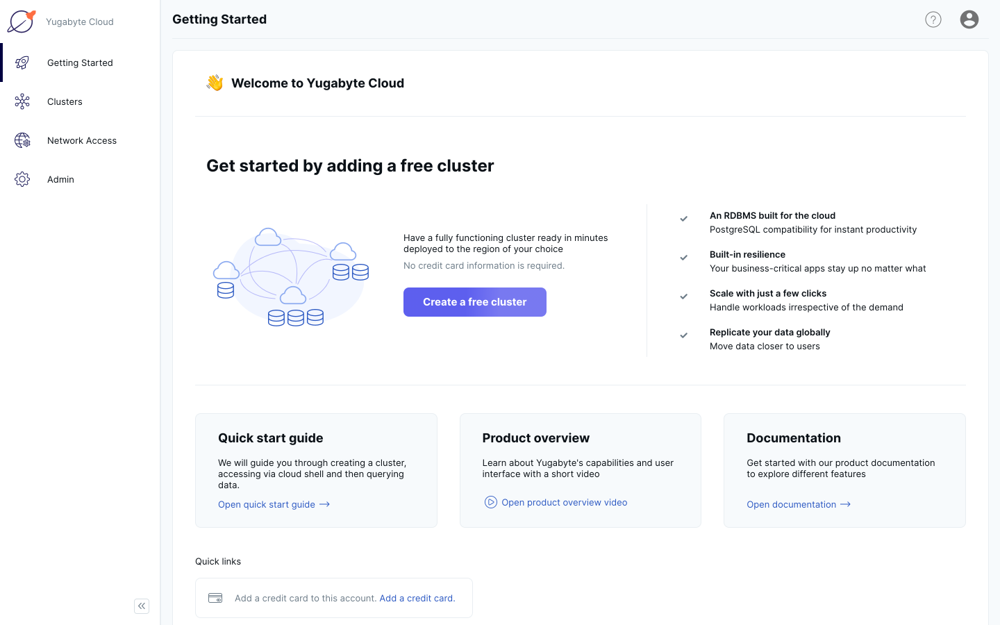

3. Select Yugabyte Cloud Free and click the Next button.
    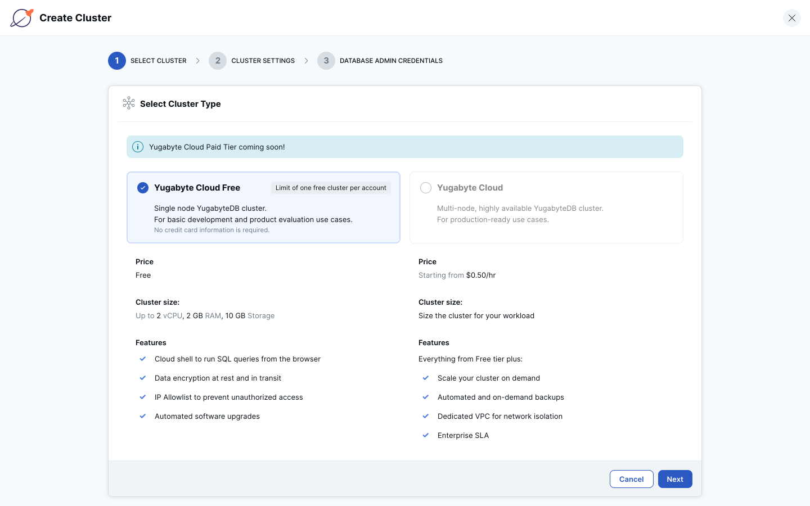

4. Select a cloud provider for your cluster, name your cluster, select a region, and click the Next button.
    

5. Copy the default admin credentials by clicking the Copy Credentials link. Then check the “I have copied the admin credentials” checkbox and click the Create Cluster button.

    a. You can also set your own admin credentials by selecting the “Add your own credentials” radio button and entering your own credentials.
    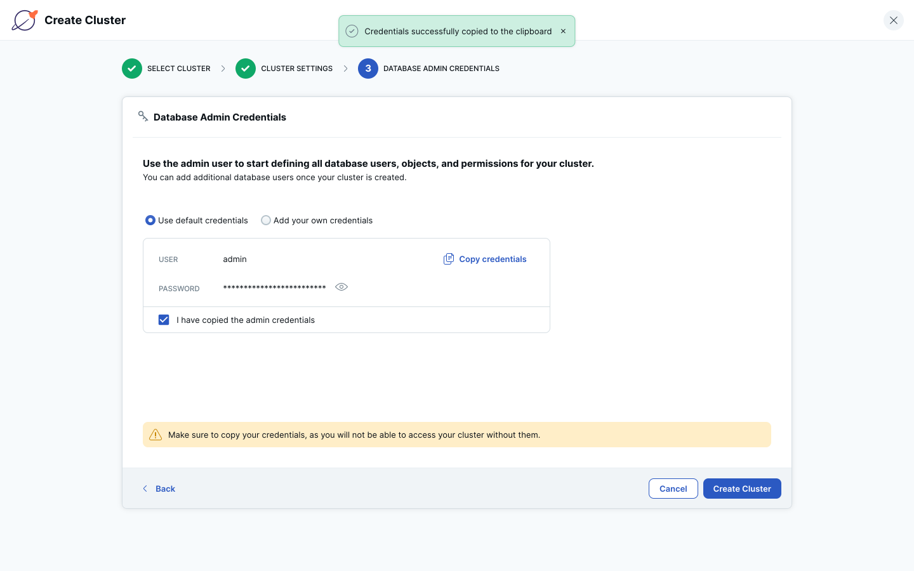

6. Wait for your cluster to be provisioned. Click on “Add IP Allow List” in the top section of the Clusters page.
    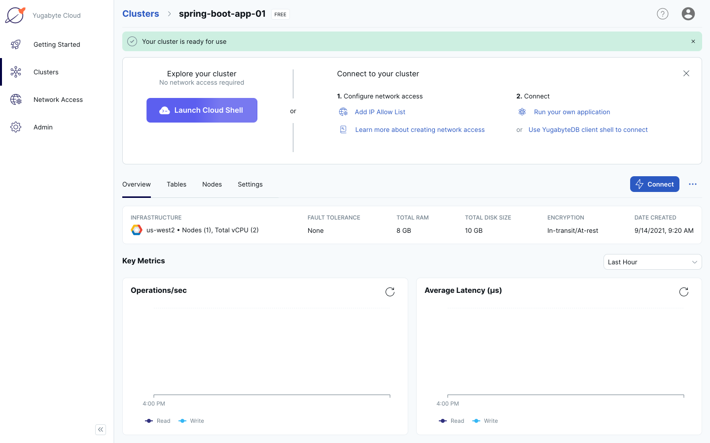

7. Click the Create New List and Add to Cluster button.
    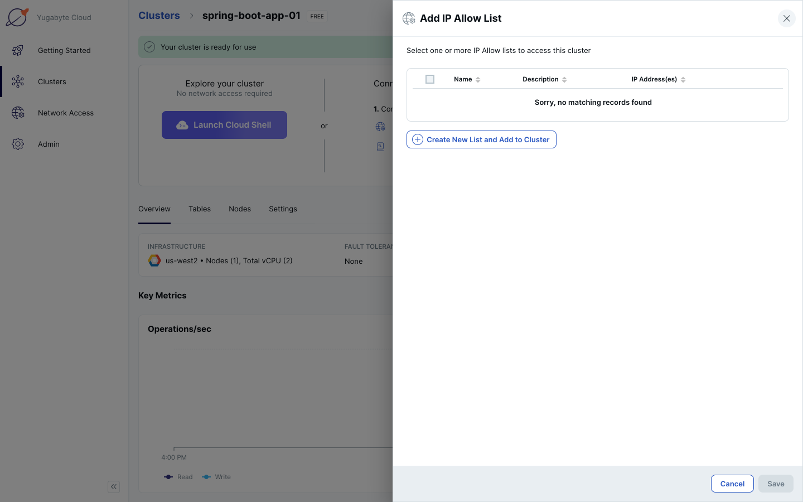

8. In the Name text box, enter “all-ips”. In the IP Address(es) or Range text box, enter “0.0.0.0/0”. Click the Save button. This will allow traffic from all IP addresses to your cluster.

    a. Allowing all IPs access to your cluster is for development purposes only. When you deploy an application to Production, you will want to specify only the specific IP addresses or ranges that need access to your cluster.
    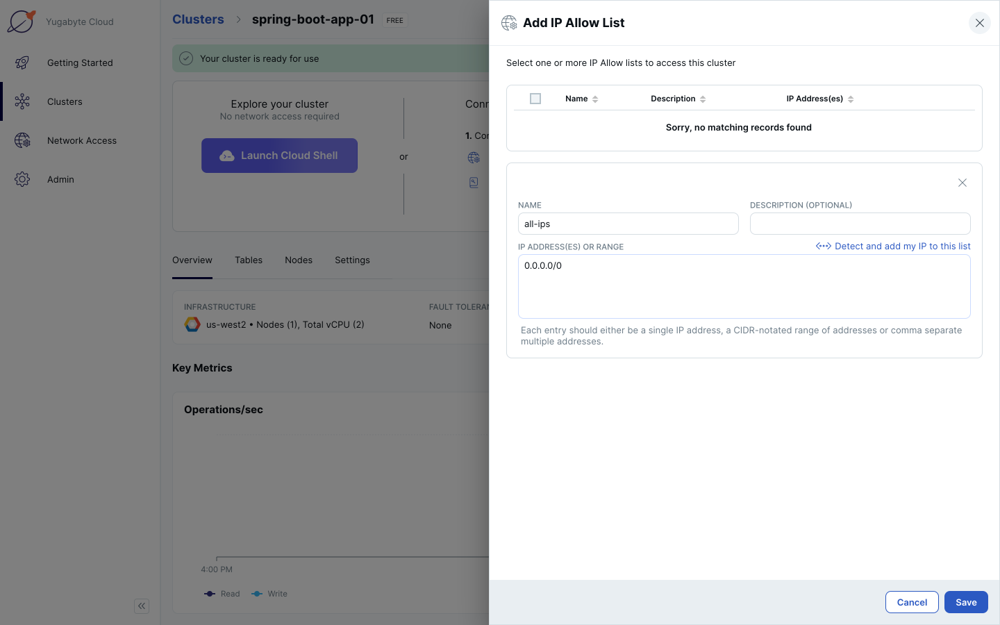


Your cluster is now created in Yugabyte Cloud and is accessible to all IP addresses. Leave this page open, as you’ll be accessing the Cloud Shell later to create an application database and user.


### **Download the Spring Boot PetClinic sample application and connect it to Yugabyte Cloud**

Note: Instructions for how to connect this application to YugabyteDB are in `spring-petclinic/src/main/resources/db/yugabytedb/petclinic_db_setup_yugabytedb.md` from the repo you clone below.

1. On your computer from terminal, clone the Spring Boot PetClinic sample application: `git clone https://github.com/yugabyte/spring-petclinic.git`.
    ```
    $ git clone https://github.com/yugabyte/spring-petclinic.git
    Cloning into 'spring-petclinic'...
    remote: Enumerating objects: 8616, done.
    remote: Counting objects: 100% (18/18), done.
    remote: Compressing objects: 100% (18/18), done.
    remote: Total 8616 (delta 1), reused 13 (delta 0), pack-reused 8598
    Receiving objects: 100% (8616/8616), 7.29 MiB | 19.03 MiB/s, done.
    Resolving deltas: 100% (3268/3268), done.
    ```

2. `cd spring-petclinic`.

3. Copy the contents of `spring-petclinic/src/main/resources/db/yugabytedb/user.sql`.

4. In Yugabyte Cloud, click on “Connect”. Click on Connect to your Application.
    

5. Save your host address and port (highlighted in the screenshot below) for later. Click the Back link in the Connect to Cluster navigation breadcrumb.
    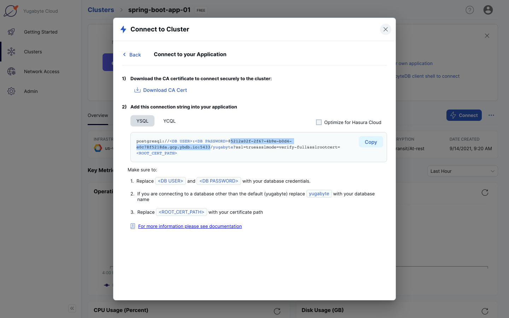

6. Click the Launch Cloud Shell button.

7. Leave the default Database Name, Database User Name, and API Type. Click the Confirm button. This will launch the Cloud Shell.
    

8. Enter the admin password you copied previously. After you enter the password, you will have a standard YSQL shell (exactly like a PSQL shell in PostgreSQL) that you can interact with from your browser.
    ```
    Password for user admin:
    ysqlsh (11.2-YB-2.4.2.0-b0)
    SSL connection (protocol: TLSv1.2, cipher: ECDHE-RSA-AES256-GCM-SHA384, bits: 256, compression: off)
    Type "help" for help.

    yugabyte=#
    ```

9. Go to [http://localhost:8080](http://localhost:8080/). The PetClinic sample application should be available.
    


The PetClinic sample application is now connected to your Yugabyte Cloud cluster and running locally.


### **Containerize the Spring Boot PetClinic sample application**

1. Start Docker on your computer and containerize your Spring Boot PetClinic sample application: `./mvnw spring-boot:build-image`.

2. Tag your image: `docker tag [image_id] spring-petclinic` – you can find your image id by running `docker image ls`.

3. Run your image as a container in Docker to make sure it’s working correctly: `docker run -d --name=spring-petclinic -p 8080:8080 -e JAVA_OPTS="-Dspring.profiles.active=yugabytedb -Dspring.datasource.url=jdbc:postgresql://[host]:[port]/petclinic?load-balance=true -Dspring.datasource.initialization-mode=never" spring-petclinic`.

    a. Go to [http://localhost:8080](http://localhost:8080/). The PetClinic sample application should be available.


The PetClinic sample application is now connected to your Yugabyte Cloud cluster and running locally on Docker.


### **Deploy the Spring Boot PetClinic sample application image to Google Kubernetes Engine (GKE)**

1. Go to [https://console.cloud.google.com/](https://console.cloud.google.com/) and sign up for/sign in to Google Cloud Platform (GCP).

2. Type “artifact registry” in the search bar and click on “Artifact Registry”.
    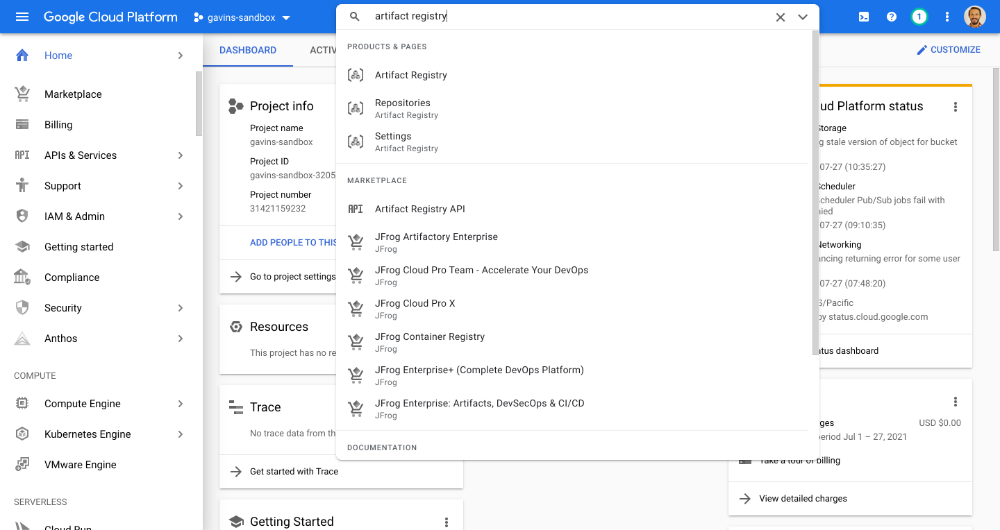

3. Click on the Enable button for the Artifact Registry API.
    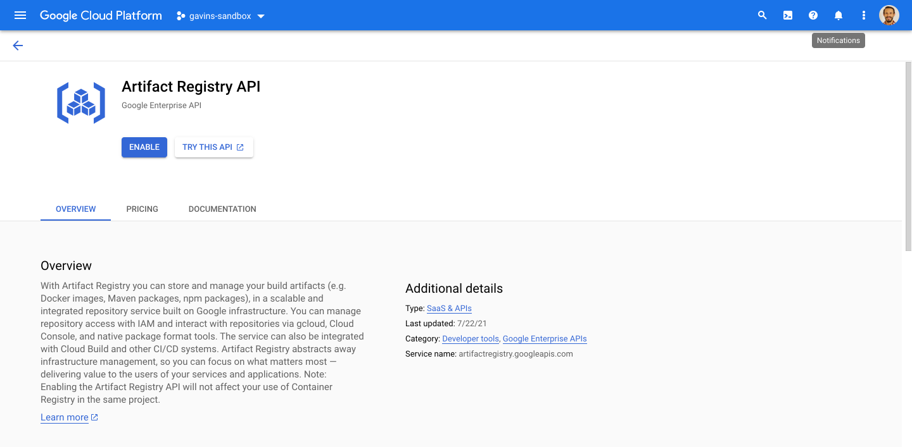

4. Click Create Repository.
    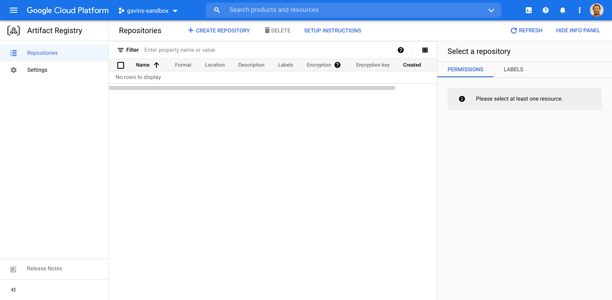

5. Give your repository a Name, make sure Docker is selected for Format, and choose a Region. Click the Create button.
    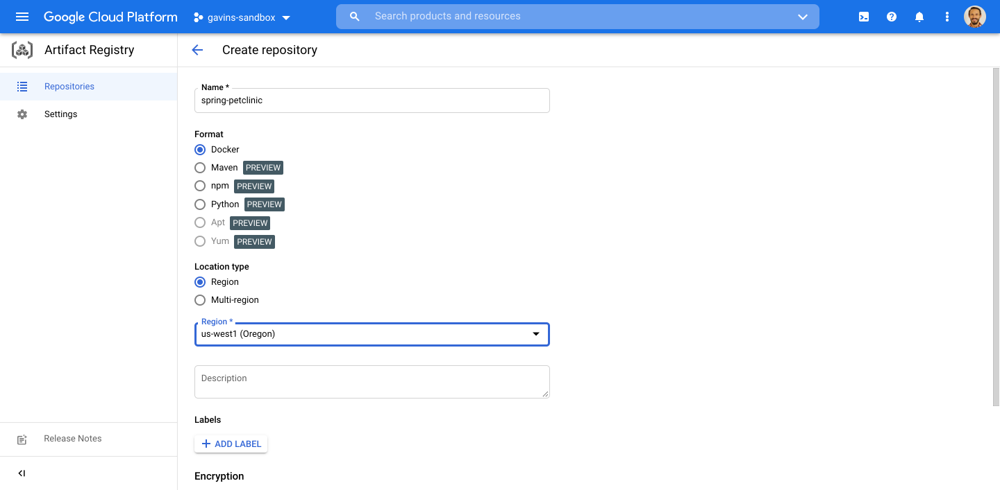


6. Click into your new repository and copy its URL.
    

7. On your computer from terminal, configure Docker to use gcloud for authentication: `gcloud auth configure-docker [region]-docker.pkg.dev`.
    ```
    $ gcloud auth configure-docker us-west1-docker.pkg.dev
    Adding credentials for: us-west1-docker.pkg.dev
    After update, the following will be written to your Docker config file
    located at [/Users/gavinjohnson/.docker/config.json]:
    {
    "credHelpers": {
    "us-west1-docker.pkg.dev": "gcloud"
    }
    }
    Do you want to continue (Y/n)?  y
    Docker configuration file updated.
    ```

8. Tag your PetClinic image with your Artifact Registry repo: `docker tag spring-petclinic:latest [repo_url]/spring-petclinic:latest`.

9. Push your PetClinic image to your repo in Artifact Registry: `docker push [repo_url]/spring-petclinic:latest`.
    ```
    $ docker push us-west1-docker.pkg.dev/gavins-sandbox-320519/spring-petclinic/spring-petclinic:latest
    The push refers to repository [us-west1-docker.pkg.dev/gavins-sandbox-320519/spring-petclinic/spring-petclinic]
    1dc94a70dbaa: Pushed
    0d29ec96785e: Pushed
    888ed16fa8d4: Pushed
    ...
    ```
    If you go to your repo in Artifact Registry, you should see the image you just pushed.
    

10. Type “gke” in the search bar and click on “Kubernetes Engine”.
    

11. Click on the Enable button for the Kubernetes Engine API.
    

12. Click Create.
    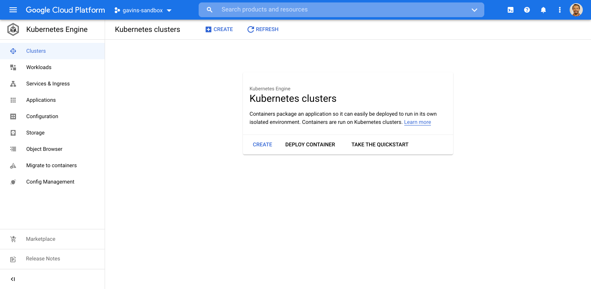

13. Click the Configure button under Autopilot.
    

14. Enter a Name, select a Region, and click the Create button.
    

15. After your cluster has been created, click on Workloads in the left-navigation panel.
    

16. Click on Deploy.
    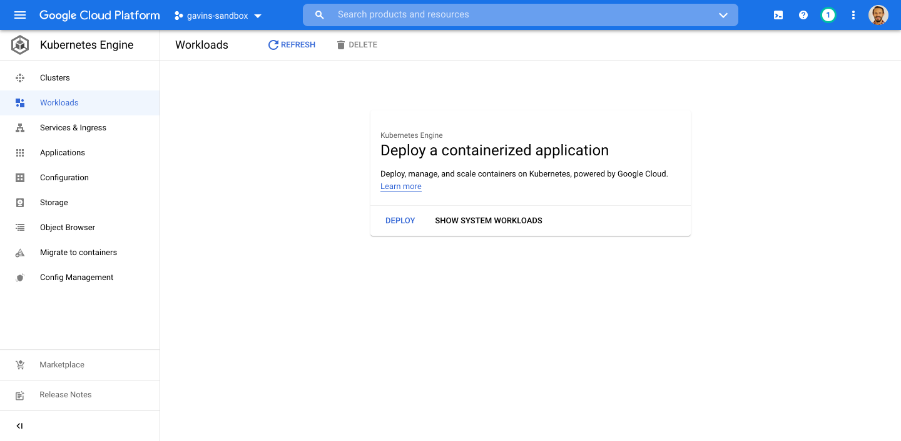

17. Select Existing Container Image and click Select in the Image Path.
    

18. Click on Artifact Registry, expand the folders out, select the image under `spring-petclinic`, and click the Select button.
    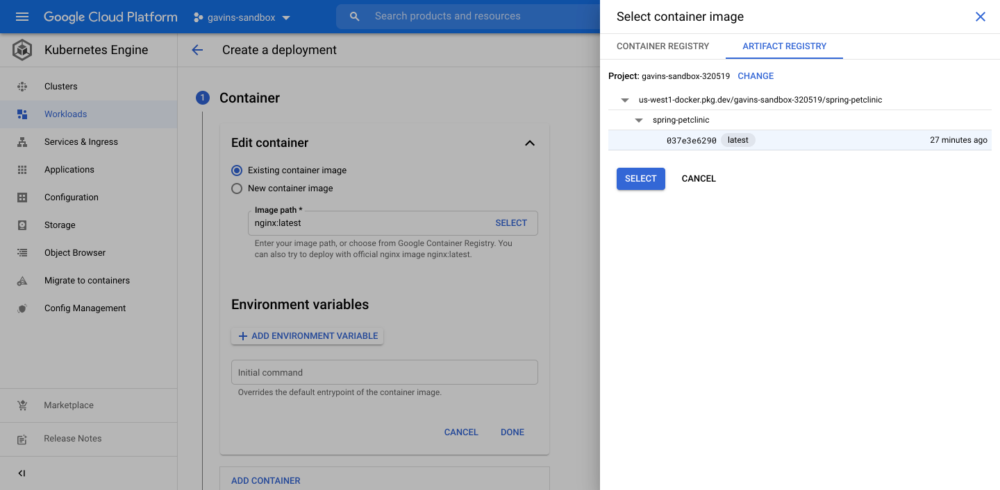

19. Click the Add Environment Variable button and enter:
    a. Key: `JAVA_OPTS`
    b. Value: `-Dspring.profiles.active=yugabytedb -Dspring.datasource.url=jdbc:postgresql://[host]:[port]/petclinic?load-balance=true -Dspring.datasource.initialization-mode=never`
    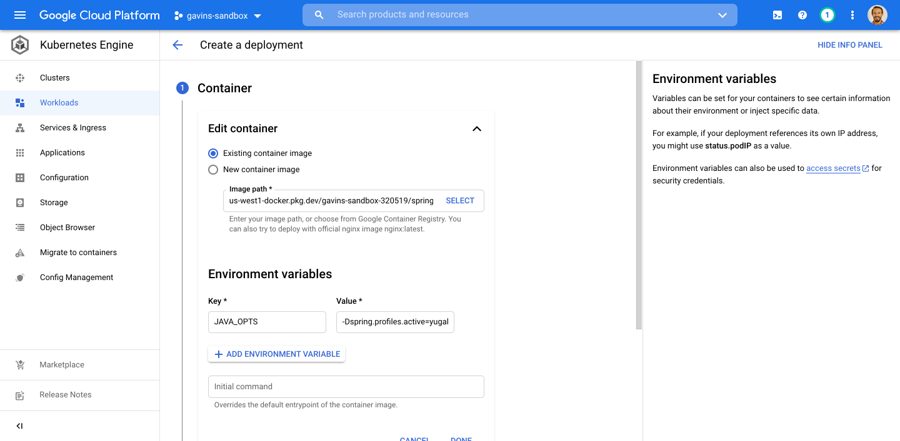

20. Click the Continue button.

21. Enter a Name for your application and click the Deploy button (everything else should be auto-filled).
    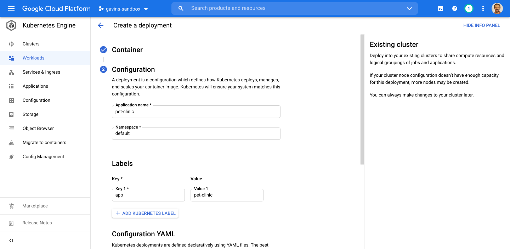

22. After your workload is deployed, click Expose on the Deployment Details.
    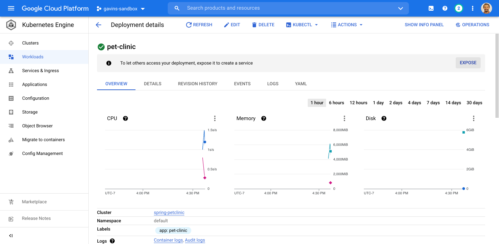

23. Set Port to 80, Target Port to 8080 and Service Type to Load Balancer. Click the Expose button.
    

24. After the load balancer is created, the Service Details page displays.
    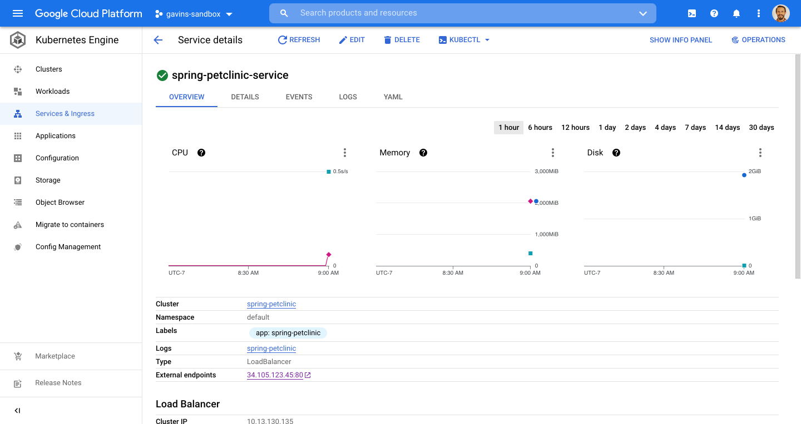

25. If you click on the External Endpoints link ([http://34.105.123.45/](http://34.105.123.45/)), the PetClinic sample application should be available.
    


The PetClinic sample application is now connected to your Yugabyte Cloud cluster and running on Kubernetes on GKE.


## **What’s Next?**

Give Yugabyte Cloud a try by signing up for a [free tier account](https://cloud.yugabyte.com/register) in a couple of minutes. Got questions? Feel free to ask them in our YugabyteDB [community Slack](https://yugabyte-db.slack.com/join/shared_invite/zt-nvtsd9px-mV24Ue04YsJmJrSE5FJVPQ#/shared-invite/email) channel.