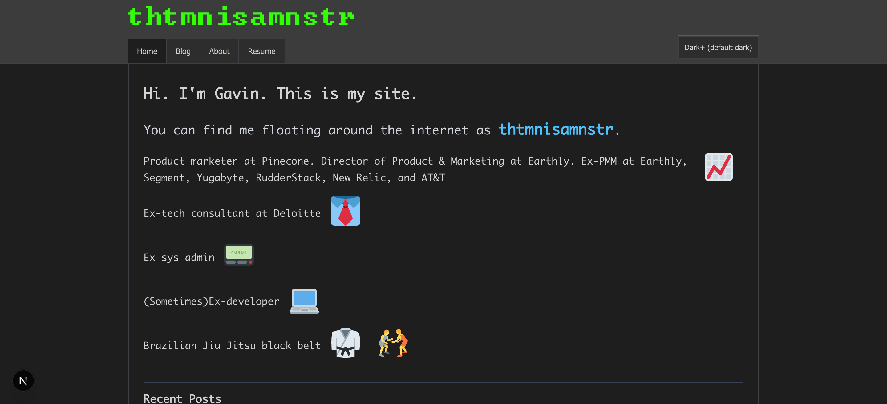

# thtmnisamnstr-dotcom

This is the source code for my personal website at [https://thtmnisamnstr.com](https://thtmnisamnstr.com). It is a Next.js site with a theme inspired by VS Code.

## Tech Stack
* Node.js >=22 <26
* Next.js 16
* [Netlify](https://www.netlify.com/) for hosting
* [Segment](https://segment.com/) for analytics

## How to run, build, and verify
### Running locally
* Clone the repo.
* Run `npm install`.
* Run `npm run dev` and open [http://localhost:3000](http://localhost:3000).

### Building the site
* Clone the repo.
* Run `npm install`.
* Run `npm run build` (this also generates RSS feeds and sitemap output in `public/`).
* Optionally run `npm run serve` to serve the production build locally.

### Quality checks
* Run `npm run lint` for lint checks.
* Run `npm run typecheck` for TypeScript checks.
* Run `npm run test` for unit/integration tests.
* Run `npm run verify` to run lint, typecheck, tests, and build together.
* Pull requests run these checks in GitHub Actions along with runtime crawl and Lighthouse assertions.

### Cleanup
* Run `npm run clean` to remove local build/test/cache artifacts and generated outputs.

### Runtime regression crawl
* Build first: `npm run build`.
* Serve locally: `npm run serve -- --port 3000`.
* In another shell, run `npm run test:e2e:crawl` to crawl all sitemap routes and fail on runtime/image errors.

### Image optimization
* Run `npm run optimize:images` to optimize local image assets.
* Only files `>=1MB` are recompressed by default.

### Deploying the site
* Deploy via your Netlify site configuration connected to this repository.
* Ensure required environment variables are set in Netlify (for example Segment keys if used).

## License
[MIT](./LICENSE)
