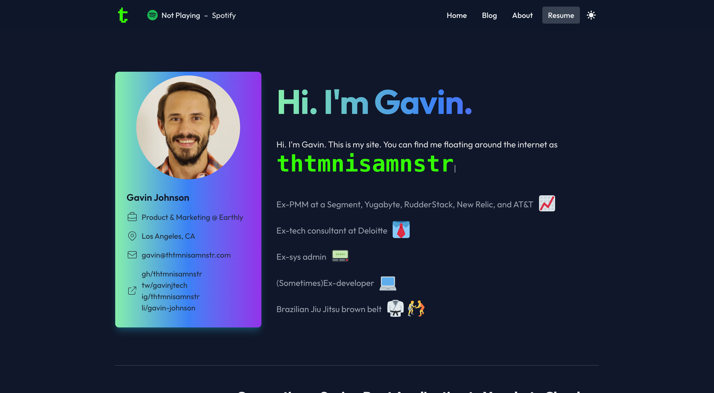

# thtmnisamnstr-dotcom

This is the source code for my personal website at https://thtmnisamnstr.com. It is a modified version of [Leo Huynh's personal website](https://www.leohuynh.dev/) \[[repo](https://github.com/hta218/leohuynh.dev)\].

## Tech Stack
*   Node.js 19
*   Next.js 13
*   [Netlify](https://www.netlify.com/) for hosting
*   [Segment](https://segment.com/) for analytics
*   [Earthly](http://earthly.dev/) for builds

## How to run, build, and upgrade dependencies
### Running locally
*   Clone the repo
*   Run `earthly +preview`, and the site will run on http://localhost:8081.

### Deploying the site
Deploying the site requires building at deploy. The site uses `next/image`. Netlify requires `@netlify/plugin-nextjs` and running `netlify deploy` with the `--build` argument to work with `next/image`.
*   Clone the repo.
*   Run `earthly --push +deploy --NODE_ENV=production`, and the site will build and deploy to Netlify based on your Netlify environment variables.
    *   Make sure Docker is started before running Earthly commands.
**Note:** You must add the `SPOTIFY_CLIENT_ID`, `SPOTIFY_CLIENT_SECRET`, and `SPOTIFY_REFRESH_TOKEN` environment variables to your Netlify site.

### Building the site
Building the site standalone isn't super useful unless you want to debug your Netlify build. Since build is required at deploy, build and deploy can't be isolated.
*   Clone the repo.
*   Run `earthly +build`, and the site will build and save build outputs to your project.
    *   Make sure Docker is started before running Earthly commands.

### Dependency management and package install/uninstall
*   To update dependencies and remove unneeded dependencies, run `earthly +upgrade`. `npm-check` and `taze` are used to maintain dependencies.
    * Manually upgrade by running `npm run deps-npm-check` and `npm run deps-taze`.
*   To install modules, run `npm install --force`.
*   To uninstall modules, run `npm uninstall [module_name] --force`.

## License 🤝
[MIT](./LICENSE)

## Thanks
Thanks to [Leo Huynh's personal website](https://www.leohuynh.dev/) \[[repo](https://github.com/hta218/leohuynh.dev)\] for making his website open source.
