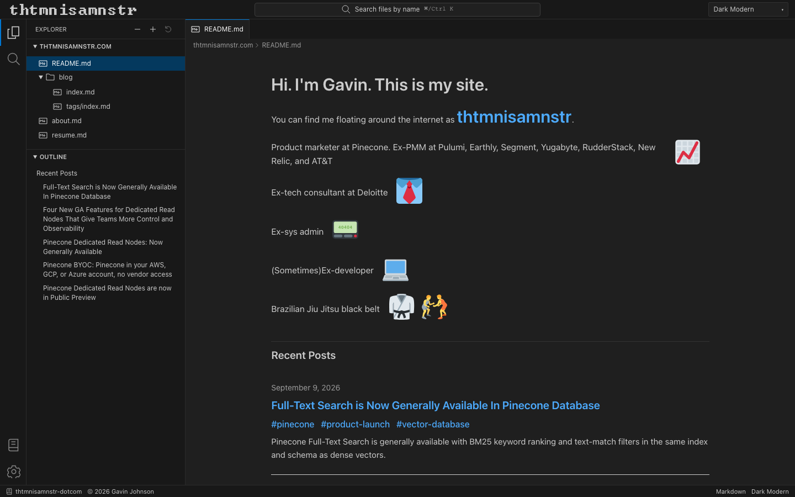

# thtmnisamnstr-dotcom

Source for my personal website, [thtmnisamnstr.com](https://thtmnisamnstr.com).



## The workbench

A VS Code-inspired shell around ordinary, readable web documents: an Activity Bar, Explorer with blog/tag navigation, heading Outline, session tabs, breadcrumbs, and a status bar. The sidebar resizes with pointer or keyboard controls, and document tabs can be reordered by dragging or with **Alt+Shift+Left/Right**. The title-bar search opens Quick Open with **⌘/Ctrl+K**; full-text blog search uses Pinecone separately.

Sixteen themes include VS Code Modern, 2026, classic, and high contrast palettes, plus adapted community themes. The initial theme follows the system preference unless a selection is saved. Phones use a modal Explorer drawer, multiple scrollable tabs, and natural document scrolling.

The shell uses React and CSS; Monaco and a split editor are not included. See the [alignment and verification report](./docs/vscode-workbench-alignment.md) for the design decisions, theme sources, and validation record.

## Stack

- Node.js 24 (use the patch pinned in [`.nvmrc`](./.nvmrc)) and npm 12.1.0, pinned in `package.json`
- Next.js 16 Pages Router, React, and MDX
- Tailwind CSS 4 and semantic VS Code color tokens
- Netlify hosting, Segment analytics, and Pinecone blog search
- Vitest, Playwright/axe, runtime crawling, and Lighthouse CI

## Develop

Select the Node version in `.nvmrc`, then:

```sh
corepack npm ci
corepack npm run dev
```

Open [localhost:3000](http://localhost:3000). Environment variable names are documented in [`.env.example`](./.env.example); private credentials belong in an ignored local environment file.

## Build and verify

Use explicit local flags to keep production search indexing disabled:

```sh
NETLIFY=false CONTEXT=dev corepack npm run verify
corepack npm exec -- playwright install chromium
corepack npm run test:e2e:workbench
```

The repo pins Node and npm for repeatable installs. `verify` runs lint, type generation/TypeScript, unit/integration tests, and the production build, which also generates feeds and the sitemap. The workbench suite starts its own production server on port 3015; use `BASE_URL=http://localhost:<port>` to test an existing server. Individual commands are `lint`, `typecheck`, `test`, and `build`.

For the sitemap crawl:

```sh
corepack npm run serve -- --port 3012
# In another terminal:
BASE_URL=http://localhost:3012 corepack npm run test:e2e:crawl
```

When a development preview is running, perform production builds in a separate checkout or source copy so the two processes do not overwrite the same `.next` output.

PRs targeting `main` run verify, the workbench/axe suite, runtime crawl, and Lighthouse. Lighthouse takes three runs each of Home, Blog, a representative post, About, and Resume; configured minimum scores are 80 for performance and 90 for accessibility, best practices, and SEO. `corepack npm run perf:lighthouse` uploads reports to temporary public storage. For local-only reports, use the configured Lighthouse CLI's `collect` and `assert` commands without `upload`, as described in the [verification skill](./.agents/skills/verify-site/references/verification-checklist.md).

## Maintain themes and content

- **Themes:** edit metadata in [`constant/themes.ts`](./constant/themes.ts). Upstream palettes and their MIT license are pinned in [`data/themes`](./data/themes); `corepack npm run themes:generate` regenerates the checked-in [`css/themes.css`](./css/themes.css) offline. Workbench styles and documented web contrast adjustments live in [`css/workbench.css`](./css/workbench.css). Keep generated CSS reproducible and run the theme/axe checks after palette changes.
- **Blog/resume workflows:** repository skills under [`.agents/skills`](./.agents/skills) cover `$update-blogs`, `$update-resume`, `$update-site`, and `$verify-site`. New posts enter lists and the workbench automatically.
- **Images:** `corepack npm run optimize:images` scans local image assets and recompresses files of at least 1 MB by default; inspect its scope before using it for a small content change.
- **Screenshot:** the README image is a 1440 × 900 desktop capture of the current homepage in Dark Modern, stored under `docs/images` rather than shipped as a public site asset. Refresh it after substantial visual changes.
- **Cleanup:** `corepack npm run clean -- --dry-run` previews generated paths; `corepack npm run clean` removes them, including `node_modules`. Build output, generated Next types, feeds, sitemap, caches, and browser reports are ignored. Source theme CSS, upstream palettes/licenses, docs, and the README screenshot are versioned.

## Deploy

Netlify builds the repository using [`netlify.toml`](./netlify.toml). Configure the required environment variables in Netlify. Automatic Pinecone indexing runs only with `NETLIFY=true` and `CONTEXT=production`; `npm run reindex` writes the production index directly and is a separate operation. Local verification does not establish deployment success or fresh search results.

## License

[MIT](./LICENSE). The bundled VS Code palette snapshot retains [Microsoft's MIT license](./data/themes/LICENSE).
