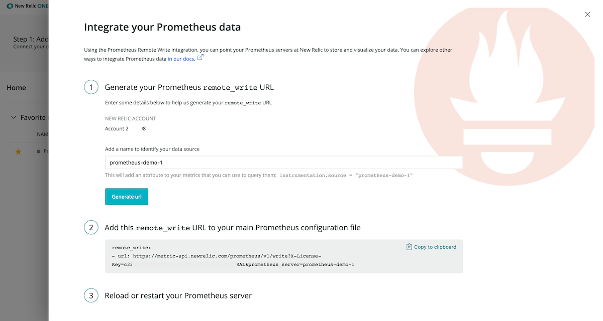
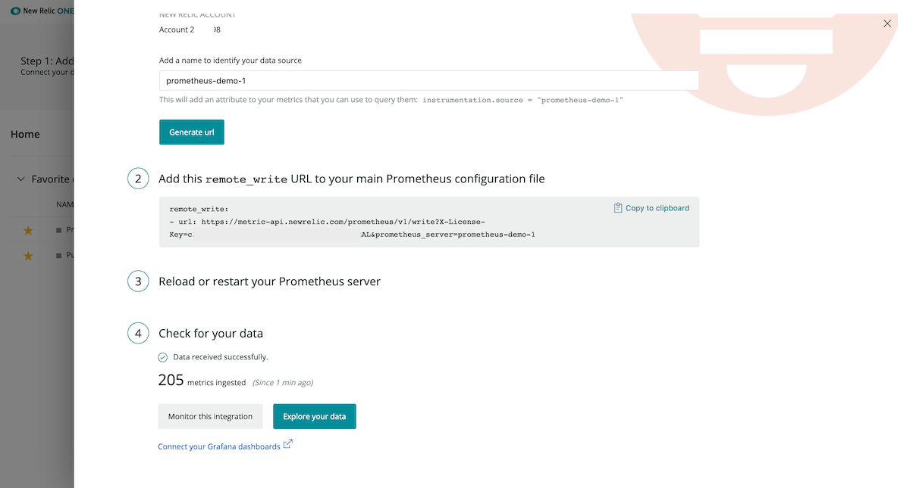
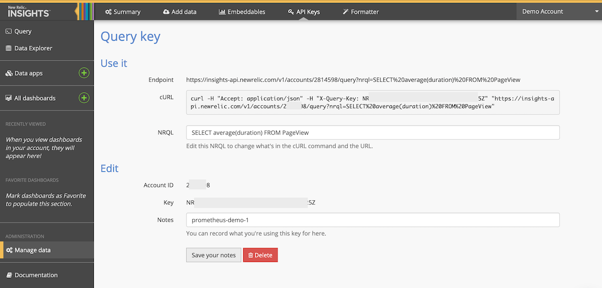
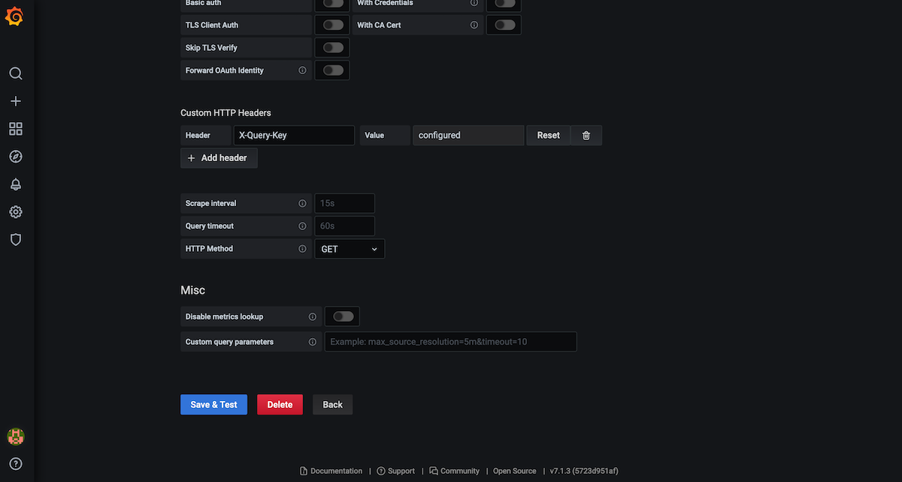
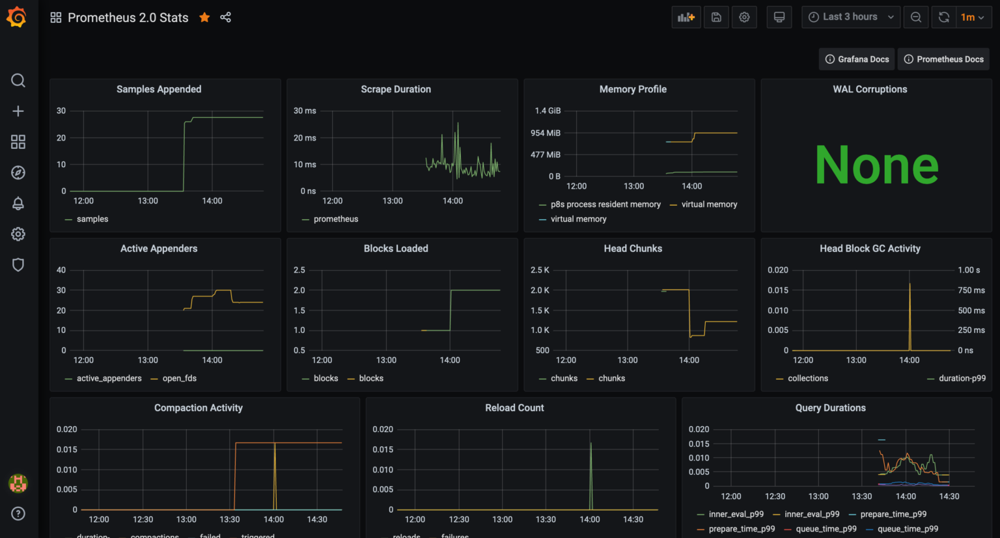

***This post was originally published on [New Relic's blog](https://blog.newrelic.com/product-news/grafana-dashboards-prometheus-telemetry-data-platform/). I wrote this as part of a larger announcement of a partnership between New Relic and Grafana Labs which included [this blog post on the New Relic blog](https://blog.newrelic.com/product-news/grafana-new-relic-observability-for-all/) of an interview with Lew Cirne, CEO of New Relic, and Raj Dutt, CEO of Grafana Labs; [this blog post on the Grafana blog](https://grafana.com/blog/2020/08/10/a-conversation-about-grafana-labs-new-partnership-with-new-relic/) covering the same interview, this [New Relic press release](https://newrelic.com/press-release/20200810); [the same press release made by Grafana](https://grafana.com/about/press/2020-08-10-new-relic-and-grafana-labs-partnership/); and a bunch of YouTube videos of the interview with Lew and Raj ([video 1](https://www.youtube.com/watch?v=9q264BdoTHQ), [video 2](https://www.youtube.com/watch?v=LCk1pbCKnho), [video 3](https://www.youtube.com/watch?v=zr1cH8C4dHw), and [video 4](https://www.youtube.com/watch?v=IICqvxbDUnc)).***
<br />

Grafana is great -- and it makes data look really good.

We’ve talked with plenty of you who use Grafana to visualize and alert on disparate data sets, and the general consensus is you love it. It’s easy to get up and running; it connects to a wide range of telemetry data stores; and it has plenty of [official and community-built dashboards](https://grafana.com/grafana/dashboards) to get you started. Grafana is also open source, which is a bonus for us all.

You’ve spent years building dashboards in Grafana. You’ve come to rely on them, and you have no desire to lose them.

And we don’t want you to.

To that end, we’ve teamed up with [Grafana Labs](https://grafana.com) so you can use our [Telemetry Data Platform](https://newrelic.com/platform/telemetry-data-platform) as a data source for Prometheus metrics and surface them in your existing dashboards. Now you can keep Prometheus and Grafana and seamlessly tap into the additional reliability, scale, and security provided by New Relic.

## A platform link from Prometheus to Grafana
Prometheus’ built-in remote write capability forwards metrics from your existing Prometheus servers to the Telemetry Data Platform, [a fully managed, elastic, time-series platform](https://blog.newrelic.com/product-news/introducing-telemetry-data-platform/). The Telemetry Data Platform gives you fully connected, global views of the relationships between all your data sources—from Prometheus metrics to application logs and distributed traces.

Setting up the Prometheus remote write integration and configuring the Telemetry Data Platform as a Prometheus data source in Grafana won’t interrupt your current experience. Your existing Grafana dashboards won’t change—they’ll just pull Prometheus data from New Relic. You can even build new ones with PromQL based data stored in New Relic.

## How to configure the Telemetry Data Platform as a Prometheus data store in Grafana
In this two-step example, we’ll show you how to replace your Prometheus data store with the Telemetry Data Platform and add it as a Prometheus data source in Grafana. In the end, you’ll be able to send Prometheus data to New Relic, and Grafana will populate your existing Prometheus-specific dashboards with that data.

**Note:** This process requires Prometheus version 2.15.0 or higher and Grafana version 6.7.0 or higher. You’ll also need to [sign up for New Relic](https://newrelic.com/signup/).

### Step 1: Get data flowing into New Relic with the Prometheus remote write integration
Navigate to [Instrument Everything – US](http://one.newrelic.com/launcher/nr1-core.settings?pane=eyJuZXJkbGV0SWQiOiJ0dWNzb24ucGxnLWluc3RydW1lbnQtZXZlcnl0aGluZyJ9)  or [Instrument Everything – EU](http://one.eu.newrelic.com/launcher/nr1-core.settings?pane=eyJuZXJkbGV0SWQiOiJ0dWNzb24ucGxnLWluc3RydW1lbnQtZXZlcnl0aGluZyJ9), click the **Prometheus** tile, and complete the following steps:
1. Enter a name for the Prometheus server you’re connecting to and generate your `remote write` URL.

2. Copy and add the generated `remote write` snippet (with URL) to your Prometheus configuration file (`prometheus.yml`). A good place to add this information is under `global_config`, at the same indentation level as the `global` section.
    ```
    # my global config
    global:
    scrape_interval:     15s # Set the scrape interval to every 15 seconds. Default is every 1 minute. 
    evaluation_interval: 15s # Evaluate rules every 15 seconds. The default is every 1 minute.
    # scrape_timeout is set to the global default (10s).

    remote_write:
    - url: https://metric-api.newrelic.com/prometheus/v1/write?X-License-Key=[prometheus-demo-1 key]&prometheus_server=prometheus-demo-1
    ```
    If you don’t have a configuration file, check out the [Prometheus configuration docs](https://prometheus.io/docs/introduction/first_steps/#configuring-prometheus), or refer to [this example configuration file](https://github.com/prometheus/prometheus/blob/master/documentation/examples/prometheus.yml).
3. Restart your Prometheus server.
4. Click **See your data**.You should get a `“Data received successfully...”` message, but it may take a few minutes to see your data in New Relic.


Boom! Now your Prometheus data is flowing into the Telemetry Data Platform.

*For more information on how to set up the Prometheus remote write integration, check out our [docs](https://docs.newrelic.com/docs/integrations/prometheus-integrations/install-configure/set-your-prometheus-remote-write-integration).*

### Step 2: Configure your Grafana dashboards to use Prometheus data stored in New Relic
When you switch to the Telemetry Data Platform as your Prometheus data store in Grafana, you can keep your Prometheus dashboards as they are—no need to lose or rebuild them. You just need to add the Telemetry Data Platform as a Prometheus data source.
1. Generate a New Relic Query key. From the New Relic One home screen, click the **More > Insights**, and in the left-hand nav of Insights, click **Manage data > API Keys**.
2. Click the **+** icon next to **Query Keys**, and in the **Notes** field, enter a short description of what you’re using the key for, click **Save your notes**.

3. Click **Show** and copy your new API key, as you’ll need it later.
4. From the Grafana home page, click **Configuration > Data Sources**. You should see your existing Prometheus data source. Click it to edit.
5. Update the **URL** field of the data source based on your New Relic data region:
    * US: [https://prometheus-api.newrelic.com](https://prometheus-api.newrelic.com/)
    * EU: [https://prometheus-api.eu.newrelic.com](https://prometheus-api.eu.newrelic.com/)
6. Set the **Access** field to **Server**.
7. Under **Custom Headers**, select **Add Header**. Set the Header value to **X-Query-Key** and add the API key you copied above.
8. Click **Save & Test**.

You should get a `“Data source is working”` message, and if you click **Back**, the URL in your Prometheus data source should reflect that it’s pointed at the Telemetry Data Platform.
9. Navigate to your Prometheus dashboard. You should see Prometheus data from New Relic populating your charts.


Boom! Now your Prometheus data is being stored in New Relic and being used in Grafana for visualization. Easy. Not a single dashboard to rebuild.

*For more information on how to configure New Relic as a Prometheus data source for Grafana, check out our [docs](https://docs.newrelic.com/docs/integrations/grafana-integrations/set-configure/configure-new-relic-prometheus-data-source-grafana).*

## Grafana Enterprise users: query all Telemetry Data Platform data from Grafana!
Why stop at Prometheus data? With the Telemetry Data Platform, you can ingest metrics, events, logs, and traces from any source, including Telegraf, OpenTelemetry, Logstash, and Kubernetes. Your Grafana dashboards can reflect it all.

If you use [Grafana Enterprise](https://grafana.com/products/enterprise/), be sure to install the [New Relic data source plugin](https://grafana.com/grafana/plugins/grafana-newrelic-datasource). With this plugin, you can use the [New Relic query language (NRQL)](https://docs.newrelic.com/docs/query-data/nrql-new-relic-query-language/getting-started/nrql-syntax-clauses-functions) to query metrics, logs, and traces from other data sources you’ve stored in the Telemetry Data Platform. Use those NRQL results to build telemetry dashboards in Grafana Enterprise.

Check out the [Grafana Labs blog post about the plugin](https://grafana.com/blog/2020/07/22/introducing-the-new-and-improved-new-relic-plugin-for-grafana/) for more information.

## Grafana Labs and New Relic—better together
Given the rate of innovation and diversity of technology, making real, impactful observability tooling will require collaboration in areas where competition has traditionally existed. We’re excited about this collaboration with Grafana Labs, and we’re excited to [bring observability to everyone](https://blog.newrelic.com/product-news/new-relic-one-observability-made-simple/). When you’re ready to get started, [sign up for a Grafana Enterprise trial](http://newrelic.com/grafana-enterprise-trial), and get those dashboards populated.