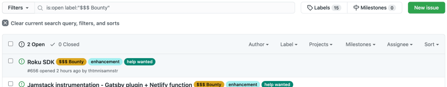

RudderStack is built around open source software. The main component of RudderStack, [rudder-server](https://github.com/rudderlabs/rudder-server), as well as a significant amount of the rest of our software is open source. Our engineering team builds pretty much all of our open source software. We get some contribution but not as much as we'd like.

We also have enhancements (and integration tests and probably some bugs) that would be great to have but are not a top priority for our engineering team.

We want open source developers, people like you, to build some of these enhancements. And we are going to pay you to do it.

## Paying for open source contributions... What???
Yep. We are going to pay open source developers to contribute to our repos. It's only fair. This is work that is valuable to RudderStack, that we want built, and that we don't have the capacity to build ourselves. There are tons of open source developers that are more than capable and qualified to do the work. We should pay them to do it.

## How does it work?
Go to the [rudder-server repo](https://github.com/rudderlabs/rudder-server), go to Issues, and filter the issues to ones with the label `$$$ Bounty`.

If the Issue has no Assignee, it is open for application.

### How do I apply?
* Apply to work on any unassigned Issue via the Google Form [here](https://forms.gle/Qifc1xF6Db3uBD7A8). You can apply as an individual or as a team.
  * Provide the issue number, a link to the issue, GitHub usernames for you and all team members, a single contact email, an estimated date that you think you could complete work by, and a brief note on why we should select you/your team.
  * **You and everybody on your team must have GitHub Sponsors enabled.** Details on how to enable GitHub Sponsors on your account are [here](https://docs.github.com/en/free-pro-team@latest/github/supporting-the-open-source-community-with-github-sponsors/setting-up-github-sponsors-for-your-user-account). If you are on the GitHub Sponsors waitlist and are selected, we will work with GitHub to get you approved quickly.
* If we are interested in your application, we will reach out via email. If we aren't, we will do our best to reach out in some way as well.
* Once a contributor is selected, they will be assigned the Issue in GitHub, and applications will be closed.
* After completion and a PR has been approved (not necessarily merged) by RudderStack, the contributor will be paid via GitHub sponsors in the most expedient way possible (e.g. until one-time payments are implemented for GitHub Sponsors, if bounty = $2500 => 2-months of $1000 sponsorship and 1-month of $500 sponsorship).

**\*\*\* DO NOT SUBMIT A PULL REQUEST FOR ANY BUG OR ENHANCEMENT WITH AN ASSOCIATED BOUNTY UNLESS IT IS ASSIGNED TO YOU. PULL REQUESTS FROM UNASSIGNED CONTRIBUTORS WILL BE REJECTED. \*\*\***

## What enhancements can I get paid to work on?
The first two GitHub Sponsors bounties are:
* [Issue \#655: Jamstack instrumentation - Gatsby plugin + Netlify function](https://github.com/rudderlabs/rudder-server/issues/655).  
**Bounty: $2000.**
* [Issue \#656: Roku SDK](https://github.com/rudderlabs/rudder-server/issues/656).  
**Bounty: $2000.**

We will be rolling out more of these over time. The more interest and success we have, the more we will do. So, if you like this approach and support devs getting paid for their open source contributions, go star the [rudder-server repo](https://github.com/rudderlabs/rudder-server), or, even better, see what GitHub Sponsors bounties are available and apply.