Since I’ve joined RudderStack, I’ve made dev.to a focus for us. We’ve started sponsoring the Dev Discuss podcast, we’re building content specifically for dev.to, we’re seeding conversations with `watercooler` and `discuss` posts, and we’ve started including dev.to posts in our launch tactics. It’s an important channel for us, and I want to collect data around how our org and our individual posts perform.

Getting data on the performance of posts we publish is easy for snapshots. You can either pull it manually or, better, hit the API. That only gives point-in-time data though. If you want data you can analyze over time, there’s no good solution.

But... RudderStack is a data pipeline tool. If I can pull the data via an API call, I bet I can build a pipeline to our data warehouse. And I bet I can do it in less than 25 lines of new code (excluding comments and white space).


## Defining your data set
I start by defining what data I need. I generally do this by building something of a pseudo-SQL statement; because I have a dev and database admin background, and doing this makes it easy to apply logic that you’ll eventually have to implement.

Expressed in natural language, “I want point-in-time snapshots of the RudderStack organization’s dev.to post performance on an hourly basis.” If I have this discreet, recurring data I can build all sorts of KPIs and charts that show performance over time for individual posts and the RudderStack organization overall.

To get this data, I’d need to pull the following pseudo-SQL on a scheduled daily basis.

```
SELECT organization, published timestamp, author, title, tags, views, hearts, unicorns, saves, comments
FROM dev.to posts
WHERE organization == RudderStack
ORDER BY published timestamp DESC
```

Referring to the [dev.to API documentation](https://docs.dev.to/api/), it looks like I can pull almost all of the data I need with a call to the `/articles` endpoint. The mapping from my pseudo-SQL to the keys in the `/articles` JSON response is:
* organization -> `organization.name`
* published timestamp -> `published_timestamp`
* author -> `user.username`
* title -> `title`
* tags -> `tag_list` (which is an array of strings, one for each tag)
* views -> **This endpoint can’t retrieve this data**
* hearts, unicorns, and saves -> `public_reactions_count`
* comments -> `comments_count`

For post views, I’ll have to enrich the organization’s post data with data from individual authors, starting with me. This can be done with a call to the `/articles/me/published` endpoint. If you are trying to report only on your own posts, you can skip the call to the `articles` endpoint and just use this one. The mapping for views from my pseudo-SQL to the keys in the `/articles/me/published` JSON response is:
*   views -> `page_views_count`


## Pull post data from dev.to’s API
### Get your API Key
1. Go to [https://dev.to/settings/account](https://dev.to/settings/account).
2. Scroll down to the “DEV API Keys” section.
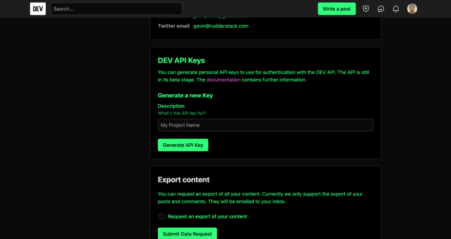
3. Enter a description and click the “Generate API Key” button. I entered “RudderStack Org Reporting” as the description. The API key is generated and you can see and expand it in the “DEV API Keys” section.
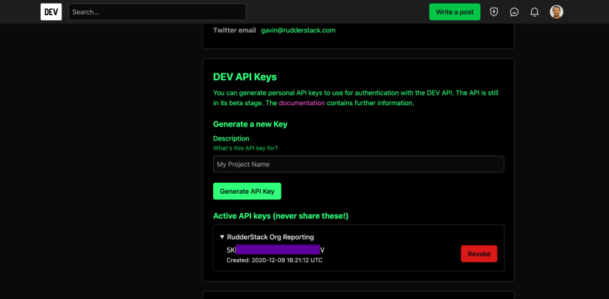
4. Copy your API key and save it for use later.

### Build your API calls
I build and test my API calls in [Postman](https://www.postman.com/), but you can use whatever tool you want. There are even free and open source tools to help with this, like Hoppscotch ([website](https://hoppscotch.io/), [GitHub](https://github.com/hoppscotch/hoppscotch)). Or just write them in a text editor and use [curl](https://curl.se/) to test the calls.

I strongly recommend referring to the [dev.to API documentation](https://docs.dev.to/api/) when building your API calls.

#### Create the RudderStack org call
1. In Postman, create a new request and enter the `/articles` endpoint URL, [https://dev.to/api/articles](https://dev.to/api/articles).
2. In the “Params” section of your request, I added the following key-value pairs.
    *   username: rudderstack
    *   state: all
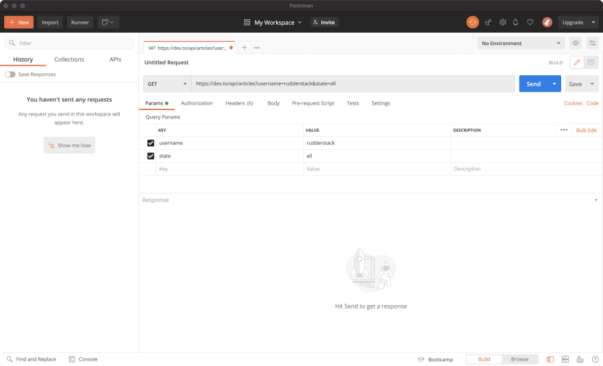
3. Click the “Send” button. A JSON array with data about all of the posts under the RudderStack org, like below.
    ```
    [
        {
            "type_of": "article",
            "id": 533667,
            "title": "Automating boilerplate: How do you do it?",
            "description": "Everyone approaches projects differently, from templates to scripts, how do you automate your boilerplate? ",
            "readable_publish_date": "Dec  5",
            "slug": "automating-boilerplate-how-do-you-do-it-3o1j",
            "path": "/rudderstack/automating-boilerplate-how-do-you-do-it-3o1j",
            "url": "https://dev.to/rudderstack/automating-boilerplate-how-do-you-do-it-3o1j",
            "comments_count": 1,
            "public_reactions_count": 3,
            "collection_id": null,
            "published_timestamp": "2020-12-05T04:19:07Z",
            "positive_reactions_count": 3,
            "cover_image": "https://res.cloudinary.com/practicaldev/image/fetch/s--ta3EqZXh--/c_imagga_scale,f_auto,fl_progressive,h_420,q_auto,w_1000/./images/tv58hw14nfw7pam1z0xo.jpg",
            "social_image": "https://res.cloudinary.com/practicaldev/image/fetch/s--mxTUBXtT--/c_imagga_scale,f_auto,fl_progressive,h_500,q_auto,w_1000/./images/tv58hw14nfw7pam1z0xo.jpg",
            "canonical_url": "https://dev.to/rudderstack/automating-boilerplate-how-do-you-do-it-3o1j",
            "created_at": "2020-12-05T04:19:07Z",
            "edited_at": null,
            "crossposted_at": null,
            "published_at": "2020-12-05T04:19:07Z",
            "last_comment_at": "2020-12-05T07:53:33Z",
            "tag_list": [
                "discuss",
                "watercooler"
            ],
            "tags": "discuss, watercooler",
            "user": {
                "name": "Nočnica Fee",
                "username": "nocnica",
                "twitter_username": null,
                "github_username": "serverless-mom",
                "website_url": null,
                "profile_image": "https://res.cloudinary.com/practicaldev/image/fetch/s--DGjyd9Wq--/c_fill,f_auto,fl_progressive,h_640,q_auto,w_640/https://dev-to-uploads.s3.amazonaws.com/uploads/user/profile_image/162459/53c35172-e0bf-450f-8f91-19982e5c41c7.jpg",
                "profile_image_90": "https://res.cloudinary.com/practicaldev/image/fetch/s--jXYW7Xzd--/c_fill,f_auto,fl_progressive,h_90,q_auto,w_90/https://dev-to-uploads.s3.amazonaws.com/uploads/user/profile_image/162459/53c35172-e0bf-450f-8f91-19982e5c41c7.jpg"
            },
            "organization": {
                "name": "RudderStack",
                "username": "rudderstack",
                "slug": "rudderstack",
                "profile_image": "https://res.cloudinary.com/practicaldev/image/fetch/s--nt7KzlDa--/c_fill,f_auto,fl_progressive,h_640,q_auto,w_640/https://dev-to-uploads.s3.amazonaws.com/uploads/organization/profile_image/3266/2a8a82ff-b6be-4e83-bb18-16396a105625.png",
                "profile_image_90": "https://res.cloudinary.com/practicaldev/image/fetch/s--oWmjLcdx--/c_fill,f_auto,fl_progressive,h_90,q_auto,w_90/https://dev-to-uploads.s3.amazonaws.com/uploads/organization/profile_image/3266/2a8a82ff-b6be-4e83-bb18-16396a105625.png"
            },
            "flare_tag": {
                "name": "discuss",
                "bg_color_hex": "#000000",
                "text_color_hex": "#FFFFFF"
            }
        },
        {
            "type_of": "article",
            "id": 530020,
            "title": "I don't have experience with Gatsby. Why am I building a Gatsby plugin then?",
            "description": "I don't have experience with Gatsby.  The only experience I had had before with Gatbsy was going thro...",
            "readable_publish_date": "Dec  1",
            "slug": "i-don-t-have-experience-with-gatsby-why-am-i-building-a-gatsby-plugin-then-6il",
            "path": "/rudderstack/i-don-t-have-experience-with-gatsby-why-am-i-building-a-gatsby-plugin-then-6il",
            "url": "https://dev.to/rudderstack/i-don-t-have-experience-with-gatsby-why-am-i-building-a-gatsby-plugin-then-6il",
            "comments_count": 2,
            "public_reactions_count": 9,
            "collection_id": null,
            "published_timestamp": "2020-12-01T19:15:03Z",
            "positive_reactions_count": 9,
            "cover_image": null,
            "social_image": "https://dev.to/social_previews/article/530020.png",
            "canonical_url": "https://dev.to/rudderstack/i-don-t-have-experience-with-gatsby-why-am-i-building-a-gatsby-plugin-then-6il",
            "created_at": "2020-12-01T19:15:03Z",
            "edited_at": "2020-12-01T19:23:31Z",
            "crossposted_at": null,
            "published_at": "2020-12-01T19:15:03Z",
            "last_comment_at": "2020-12-02T02:24:26Z",
            "tag_list": [
                "gatsby",
                "javascript",
                "react",
                "webdev"
            ],
            "tags": "gatsby, javascript, react, webdev",
            "user": {
                "name": "Christopher Wray",
                "username": "cwraytech",
                "twitter_username": null,
                "github_username": "cwray-tech",
                "website_url": "https://chriswray.dev",
                "profile_image": "https://res.cloudinary.com/practicaldev/image/fetch/s--z2Ge1NJ2--/c_fill,f_auto,fl_progressive,h_640,q_auto,w_640/https://dev-to-uploads.s3.amazonaws.com/uploads/user/profile_image/317428/9b5d34bd-4809-401c-a3d2-2623c6ac37fd.jpeg",
                "profile_image_90": "https://res.cloudinary.com/practicaldev/image/fetch/s--TJ642Wgl--/c_fill,f_auto,fl_progressive,h_90,q_auto,w_90/https://dev-to-uploads.s3.amazonaws.com/uploads/user/profile_image/317428/9b5d34bd-4809-401c-a3d2-2623c6ac37fd.jpeg"
            },
            "organization": {
                "name": "RudderStack",
                "username": "rudderstack",
                "slug": "rudderstack",
                "profile_image": "https://res.cloudinary.com/practicaldev/image/fetch/s--nt7KzlDa--/c_fill,f_auto,fl_progressive,h_640,q_auto,w_640/https://dev-to-uploads.s3.amazonaws.com/uploads/organization/profile_image/3266/2a8a82ff-b6be-4e83-bb18-16396a105625.png",
                "profile_image_90": "https://res.cloudinary.com/practicaldev/image/fetch/s--oWmjLcdx--/c_fill,f_auto,fl_progressive,h_90,q_auto,w_90/https://dev-to-uploads.s3.amazonaws.com/uploads/organization/profile_image/3266/2a8a82ff-b6be-4e83-bb18-16396a105625.png"
            }
        }, ...
    ]
    ```
4. Click on the “Code” link below the “Save” button, select “cURL”, copy the GET request, and save it for use later.
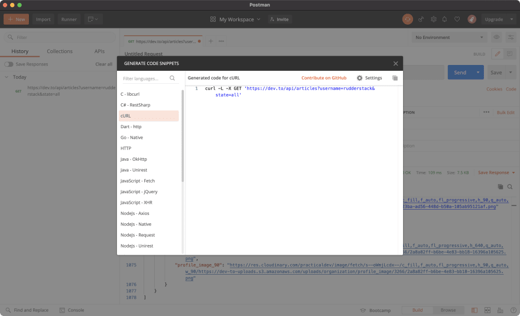

#### Create the call for my user account
1. In Postman, create a new request and enter the `/articles/me/published` endpoint URL, [https://dev.to/api/articles/me/published](https://dev.to/api/articles/me/published).
2. In the “Authorization” section of your request, select “API Key” from the “Type” drop-down, and add the following key-value pair.
    1. api_key: [YOUR DEV.TO API KEY]
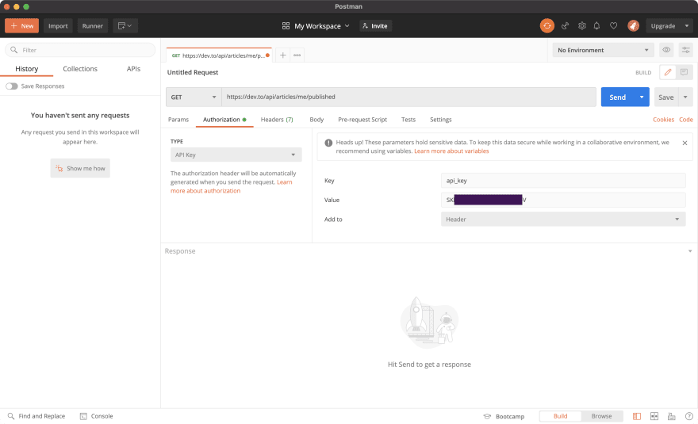
3. Click the “Send” button. A JSON array with data about all of the posts under the my account, like below.
    ```
    [
        {
            "type_of": "article",
            "id": 520849,
            "title": "Which JavaScript snippets do you use for analytics?",
            "description": "Almost everyone uses Google Analytics’ JS on their websites. What other JS snippets do you include fo...",
            "published": true,
            "published_at": "2020-11-20T20:18:10.747Z",
            "slug": "which-javascript-snippets-do-you-use-for-analytics-3mmf",
            "path": "/rudderstack/which-javascript-snippets-do-you-use-for-analytics-3mmf",
            "url": "https://dev.to/rudderstack/which-javascript-snippets-do-you-use-for-analytics-3mmf",
            "comments_count": 2,
            "public_reactions_count": 4,
            "page_views_count": 54,
            "published_timestamp": "2020-11-20T20:18:10Z",
            "body_markdown": "Almost everyone uses Google Analytics’ JS on their websites. What other JS snippets do you include for site analytics, and what do they give you that Google Analytics doesn’t?",
            "positive_reactions_count": 4,
            "cover_image": "https://res.cloudinary.com/practicaldev/image/fetch/s--mXIA0qRV--/c_imagga_scale,f_auto,fl_progressive,h_420,q_auto,w_1000/./images/mkinhwi6ut201k03nwgf.png",
            "tag_list": [
                "discuss",
                "webdev",
                "analytics",
                "rudderstack"
            ],
            "canonical_url": "https://dev.to/rudderstack/which-javascript-snippets-do-you-use-for-analytics-3mmf",
            "user": {
                "name": "Gavin",
                "username": "thtmnisamnstr",
                "twitter_username": "gavinjtech",
                "github_username": "thtmnisamnstr",
                "website_url": "https://thtmnisamnstr.com",
                "profile_image": "https://res.cloudinary.com/practicaldev/image/fetch/s--5C9EzenJ--/c_fill,f_auto,fl_progressive,h_640,q_auto,w_640/https://dev-to-uploads.s3.amazonaws.com/uploads/user/profile_image/421663/8f21d5d3-3c32-4efa-a1a6-5057e102aab8.jpg",
                "profile_image_90": "https://res.cloudinary.com/practicaldev/image/fetch/s--bjafKnny--/c_fill,f_auto,fl_progressive,h_90,q_auto,w_90/https://dev-to-uploads.s3.amazonaws.com/uploads/user/profile_image/421663/8f21d5d3-3c32-4efa-a1a6-5057e102aab8.jpg"
            },
            "organization": {
                "name": "RudderStack",
                "username": "rudderstack",
                "slug": "rudderstack",
                "profile_image": "https://res.cloudinary.com/practicaldev/image/fetch/s--nt7KzlDa--/c_fill,f_auto,fl_progressive,h_640,q_auto,w_640/https://dev-to-uploads.s3.amazonaws.com/uploads/organization/profile_image/3266/2a8a82ff-b6be-4e83-bb18-16396a105625.png",
                "profile_image_90": "https://res.cloudinary.com/practicaldev/image/fetch/s--oWmjLcdx--/c_fill,f_auto,fl_progressive,h_90,q_auto,w_90/https://dev-to-uploads.s3.amazonaws.com/uploads/organization/profile_image/3266/2a8a82ff-b6be-4e83-bb18-16396a105625.png"
            },
            "flare_tag": {
                "name": "discuss",
                "bg_color_hex": "#000000",
                "text_color_hex": "#FFFFFF"
            }
        },
        {
            "type_of": "article",
            "id": 513555,
            "title": "Devs Wanted: Get paid to contribute to RudderStack's open source software",
            "description": "RudderStack is built around open source software. The main component of RudderStack, rudder-server, a...",
            "published": true,
            "published_at": "2020-11-13T16:57:48.271Z",
            "slug": "devs-wanted-get-paid-to-contribute-to-rudderstack-s-open-source-software-bjp",
            "path": "/rudderstack/devs-wanted-get-paid-to-contribute-to-rudderstack-s-open-source-software-bjp",
            "url": "https://dev.to/rudderstack/devs-wanted-get-paid-to-contribute-to-rudderstack-s-open-source-software-bjp",
            "comments_count": 8,
            "public_reactions_count": 15,
            "page_views_count": 293,
            "published_timestamp": "2020-11-13T16:57:48Z",
            "body_markdown": "RudderStack is built around open source software. The main component of RudderStack, [rudder-server](https://github.com/rudderlabs/rudder-server), as well as a significant amount of the rest of our software is open source. Our engineering team builds pretty much all of our open source software. We get some contribution but not as much as we'd like.\n\nWe also have enhancements (and integration tests and probably some bugs) that would be great to have but are not a top priority for our engineering team.\n\nWe want open source developers, people like you, to build some of these enhancements. And we are going to pay you to do it.\n\n## Paying for open source contributions... What???\nYep. We are going to pay open source developers to contribute to our repos. It's only fair. This is work that is valuable to RudderStack, that we want built, and that we don't have the capacity to build ourselves. There are tons of open source developers that are more than capable and qualified to do the work. We should pay them to do it.\n\n## How does it work?\nGo to the [rudder-server repo](https://github.com/rudderlabs/rudder-server), go to Issues, and filter the issues to ones with the label `$$$ Bounty`.\n\nIf the Issue has no Assignee, it is open for application.\n\n### How do I apply?\n* Apply to work on any unassigned Issue via the Google Form [here](https://forms.gle/Qifc1xF6Db3uBD7A8). You can apply as an individual or as a team.\n  * Provide the issue number, a link to the issue, GitHub usernames for you and all team members, a single contact email, an estimated date that you think you could complete work by, and a brief note on why we should select you/your team.\n  * **You and everybody on your team must have GitHub Sponsors enabled.** Details on how to enable GitHub Sponsors on your account are [here](https://docs.github.com/en/free-pro-team@latest/github/supporting-the-open-source-community-with-github-sponsors/setting-up-github-sponsors-for-your-user-account). If you are on the GitHub Sponsors waitlist and are selected, we will work with GitHub to get you approved quickly.\n* If we are interested in your application, we will reach out via email. If we aren't, we will do our best to reach out in some way as well.\n* Once a contributor is selected, they will be assigned the Issue in GitHub, and applications will be closed.\n* After completion and a PR has been approved (not necessarily merged) by RudderStack, the contributor will be paid via GitHub sponsors in the most expedient way possible (e.g. until one-time payments are implemented for GitHub Sponsors, if bounty = $2500 => 2-months of $1000 sponsorship and 1-month of $500 sponsorship).\n\n**\\*\\*\\* DO NOT SUBMIT A PULL REQUEST FOR ANY BUG OR ENHANCEMENT WITH AN ASSOCIATED BOUNTY UNLESS IT IS ASSIGNED TO YOU. PULL REQUESTS FROM UNASSIGNED CONTRIBUTORS WILL BE REJECTED. \\*\\*\\***\n\n## What enhancements can I get paid to work on?\nThe first two GitHub Sponsors bounties are:\n* [Issue \\#655: Jamstack instrumentation - Gatsby plugin + Netlify function](https://github.com/rudderlabs/rudder-server/issues/655).  \n**Bounty: $2000.**\n* [Issue \\#656: Roku SDK](https://github.com/rudderlabs/rudder-server/issues/656).  \n**Bounty: $2000.**\n\nWe will be rolling out more of these over time. The more interest and success we have, the more we will do. So, if you like this approach and support devs getting paid for their open source contributions, go star the [rudder-server repo](https://github.com/rudderlabs/rudder-server), or, even better, see what GitHub Sponsors bounties are available and apply.",
            "positive_reactions_count": 15,
            "cover_image": "https://res.cloudinary.com/practicaldev/image/fetch/s--XLC8xN73--/c_imagga_scale,f_auto,fl_progressive,h_420,q_auto,w_1000/./images/ip37cwld57vi4iriamtz.png",
            "tag_list": [
                "opensource",
                "github",
                "sponsors",
                "rudderstack"
            ],
            "canonical_url": "https://dev.to/rudderstack/devs-wanted-get-paid-to-contribute-to-rudderstack-s-open-source-software-bjp",
            "user": {
                "name": "Gavin",
                "username": "thtmnisamnstr",
                "twitter_username": "gavinjtech",
                "github_username": "thtmnisamnstr",
                "website_url": "https://thtmnisamnstr.com",
                "profile_image": "https://res.cloudinary.com/practicaldev/image/fetch/s--5C9EzenJ--/c_fill,f_auto,fl_progressive,h_640,q_auto,w_640/https://dev-to-uploads.s3.amazonaws.com/uploads/user/profile_image/421663/8f21d5d3-3c32-4efa-a1a6-5057e102aab8.jpg",
                "profile_image_90": "https://res.cloudinary.com/practicaldev/image/fetch/s--bjafKnny--/c_fill,f_auto,fl_progressive,h_90,q_auto,w_90/https://dev-to-uploads.s3.amazonaws.com/uploads/user/profile_image/421663/8f21d5d3-3c32-4efa-a1a6-5057e102aab8.jpg"
            },
            "organization": {
                "name": "RudderStack",
                "username": "rudderstack",
                "slug": "rudderstack",
                "profile_image": "https://res.cloudinary.com/practicaldev/image/fetch/s--nt7KzlDa--/c_fill,f_auto,fl_progressive,h_640,q_auto,w_640/https://dev-to-uploads.s3.amazonaws.com/uploads/organization/profile_image/3266/2a8a82ff-b6be-4e83-bb18-16396a105625.png",
                "profile_image_90": "https://res.cloudinary.com/practicaldev/image/fetch/s--oWmjLcdx--/c_fill,f_auto,fl_progressive,h_90,q_auto,w_90/https://dev-to-uploads.s3.amazonaws.com/uploads/organization/profile_image/3266/2a8a82ff-b6be-4e83-bb18-16396a105625.png"
            }
        },
        {
            "type_of": "article",
            "id": 512324,
            "title": "How to start building a better CDP for free with RudderStack Cloud Free",
            "description": "RudderStack is an open-source, warehouse-first customer data platform (CDP) that builds your CDP on y...",
            "published": true,
            "published_at": "2020-11-12T17:08:26.123Z",
            "slug": "how-to-start-building-a-better-cdp-for-free-with-rudderstack-cloud-free-ghn",
            "path": "/rudderstack/how-to-start-building-a-better-cdp-for-free-with-rudderstack-cloud-free-ghn",
            "url": "https://dev.to/rudderstack/how-to-start-building-a-better-cdp-for-free-with-rudderstack-cloud-free-ghn",
            "comments_count": 1,
            "public_reactions_count": 15,
            "page_views_count": 100,
            "published_timestamp": "2020-11-12T17:08:26Z",
            "body_markdown": "[RudderStack](https://rudderstack.com) is an [open-source](https://github.com/rudderlabs/rudder-server), warehouse-first customer data platform (CDP) that builds your CDP on your data warehouse for you. RudderStack makes it easy to collect, unify, transform, and store your customer data as well as route it securely to a wide range of common, popular marketing, sales, and product tools.\n\nToday, we launched [RudderStack Cloud Free](https://app.rudderlabs.com/signup?type=freetrial), a no time limit, no credit card required, completely free tier of [RudderStack Cloud](https://resources.rudderstack.com/rudderstack-cloud) (read the blog post announcing RudderStack Cloud Free [here](https://rudderstack.com/blog/start-building-a-better-cdp-for-free-with-rudderstack-cloud-free/)). You get the same great experience you get with RudderStack Cloud Pro, with the only limitation being a cap of 500,000 events per month (that’s roughly 10,000 monthly active users for most sites and apps).\n\n*[Click here to skip the exposition and jump straight to the how to.](#how-to-sign-up)*\n\n\n## Here’s what you get with RudderStack Cloud Free\n*   **Warehouse-first**: RudderStack is the warehouse-first CDP. RudderStack builds your CDP on your data warehouse, with support for cloud data warehouses like [Amazon Redshift](https://aws.amazon.com/redshift/), [Google BigQuery](https://cloud.google.com/bigquery), and [Snowflake](https://www.snowflake.com). This approach makes it more cost effective, secure, and flexible than other CDPs.\n*   **Secure by design**: RudderStack’s core architecture was built around the principles of privacy and security. That’s the reason it is warehouse-first. RudderStack is a modern CDP that can be hosted SaaS, on-prem, or in your own cloud, so you control your customer data.\n*   **Built for devs**: RudderStack is open source and built API-first, so it is easily customizable and fits into your existing development processes. Its multitude of SDKs, sources, and destinations make it easy to instrument, ingest, and route customer data from all of your digital touchpoints.\n*   **Speed and Scale**: RudderStack is extremely scalable. A single node can easily handle hundreds of thousands of events per day. You can also have a multi-node RudderStack setup, where you can easily scale to millions of events per day. All of this is configurable in a highly secure and available environment.\n*   **Community support**: We have built a rich community of core developers who, along with our engineers, provide daily support on [Slack](https://resources.rudderstack.com/join-rudderstack-slack).\n\n\n## <a id=\"how-to-sign-up\"></a>How to sign up for and start using RudderStack Cloud Free\n*   Go to the [RudderStack signup page](https://app.rudderlabs.com/signup?type=freetrial).\n*   Enter your information in the required fields - your email address, name, organization name and the password needed to sign-in. Then, click on **Create New Account**.\n\n\n\n*   You should get a verification code sent to your email. Enter the code in the field and click on **Submit Verification Code**, as shown:\n\n\n\nThat’s it. You should now have full access to the RudderStack dashboard.\n\n\n\n\nNow, you can start instrumenting your website or app using RudderStack’s [11 SDKs](https://docs.rudderstack.com/rudderstack-sdk-integration-guides), configuring your customer data **[Sources](https://docs.rudderstack.com/sources)**, and setting up integrations with over 60 third-party **[Destinations](https://docs.rudderstack.com/destinations)**. \n\nThe following sections demonstrate how you can instrument your site with RudderStack’s JavaScript SDK to track and collect events and then route the collected event data to a common destination, [Google Analytics](https://analytics.google.com/).\n\n\n### Step 1: Adding a source\n*   Sign up for RudderStack Cloud Free by following the steps mentioned above. Once you’ve signed up, log into RudderStack Cloud Free to access your dashboard:\n\n\n\n*   Next, click on **Add Source**.\n\n\n\n*   Choose the source from which you want to collect the event data. \n \nFor this example, we will choose the **RudderStack JavaScript SDK** to track and collect events from your website. Select **JavaScript**, and click on on **Next**.\n\n\n\n*   Add a name for your source, and click on **Next**.\n\n\n\n*   You should now seen the following window, containing the source details:\n\n\n\nYour JavaScript source is now configured and ready to collect event data from your website.\n\n\n### Step 2: Adding a destination in RudderStack for routing your event data\n*   Once you have added a source, click on the **Add Destination** button, as shown:\n\n\n\n*   Choose the destination platform from the list of destinations and then click on **Next**. For this example, we want to route the collected website events to **Google Analytics**.\n\n\n\n*   Add a name for your destination and click on **Next**.\n\n\n\n*   The next step is to connect your event data source to this destination. Your previously configured JavaScript source should now appear automatically. Select the source and click on **Next**.\n\n\n\n*   Next, you need to specify the connection settings for your destination. For Google Analytics, you will need to enter the **Tracking ID**, which you can retrieve from your Google Analytics admin dashboard, as shown:\n\n\n\n*   Enter this tracking ID in the **Connections Settings** window, as shown. You can also configure the other settings as per your requirements, and then click on **Next**.\n\n\n\n*   RudderStack also lets you transform your event data before routing it to your destination. You can choose an existing transformation or create a new transformation function to do so. Select the appropriate option and then click on **Next**. \n\n\n\n\nThat’s it! Your destination is now configured successfully. The events from your JavaScript web source will start flowing to Google Analytics via RudderStack. You can also view the events coming from your source in real-time via the **Live Events** tab on the top right, as shown:\n\n\n\nYou can refer to our [documentation](https://docs.rudderstack.com/) for more information on how to configure and use RudderStack.\n\n\n## Start building a better CDP with RudderStack\n\nStart building a better, warehouse-first CDP that delivers complete, unified data to every part of your marketing and analytics stack. Sign up for [RudderStack Cloud Free](https://app.rudderlabs.com/signup?type=freetrial) today.\n\nJoin our [Slack](https://resources.rudderstack.com/join-rudderstack-slack) to chat with our team, check out our open source repos on [GitHub](https://github.com/rudderlabs), and follow us on social: [Twitter](https://twitter.com/RudderStack), [LinkedIn](https://www.linkedin.com/company/rudderlabs/), [dev.to](https://dev.to/rudderstack), [Medium](https://rudderstack.medium.com/), [YouTube](https://www.youtube.com/channel/UCgV-B77bV_-LOmKYHw8jvBw).\n",
            "positive_reactions_count": 15,
            "cover_image": "https://res.cloudinary.com/practicaldev/image/fetch/s--9AwPcpDF--/c_imagga_scale,f_auto,fl_progressive,h_420,q_auto,w_1000/./images/pxkjqm3pfjyninn89mru.png",
            "tag_list": [
                "cdp",
                "data",
                "free",
                "rudderstack"
            ],
            "canonical_url": "https://dev.to/rudderstack/how-to-start-building-a-better-cdp-for-free-with-rudderstack-cloud-free-ghn",
            "user": {
                "name": "Gavin",
                "username": "thtmnisamnstr",
                "twitter_username": "gavinjtech",
                "github_username": "thtmnisamnstr",
                "website_url": "https://thtmnisamnstr.com",
                "profile_image": "https://res.cloudinary.com/practicaldev/image/fetch/s--5C9EzenJ--/c_fill,f_auto,fl_progressive,h_640,q_auto,w_640/https://dev-to-uploads.s3.amazonaws.com/uploads/user/profile_image/421663/8f21d5d3-3c32-4efa-a1a6-5057e102aab8.jpg",
                "profile_image_90": "https://res.cloudinary.com/practicaldev/image/fetch/s--bjafKnny--/c_fill,f_auto,fl_progressive,h_90,q_auto,w_90/https://dev-to-uploads.s3.amazonaws.com/uploads/user/profile_image/421663/8f21d5d3-3c32-4efa-a1a6-5057e102aab8.jpg"
            },
            "organization": {
                "name": "RudderStack",
                "username": "rudderstack",
                "slug": "rudderstack",
                "profile_image": "https://res.cloudinary.com/practicaldev/image/fetch/s--nt7KzlDa--/c_fill,f_auto,fl_progressive,h_640,q_auto,w_640/https://dev-to-uploads.s3.amazonaws.com/uploads/organization/profile_image/3266/2a8a82ff-b6be-4e83-bb18-16396a105625.png",
                "profile_image_90": "https://res.cloudinary.com/practicaldev/image/fetch/s--oWmjLcdx--/c_fill,f_auto,fl_progressive,h_90,q_auto,w_90/https://dev-to-uploads.s3.amazonaws.com/uploads/organization/profile_image/3266/2a8a82ff-b6be-4e83-bb18-16396a105625.png"
            }
        }, ...
    ]
    ```
4. Click on the “Code” link below the “Save” button, select “cURL”, copy the GET request including the header, and save it for use later.
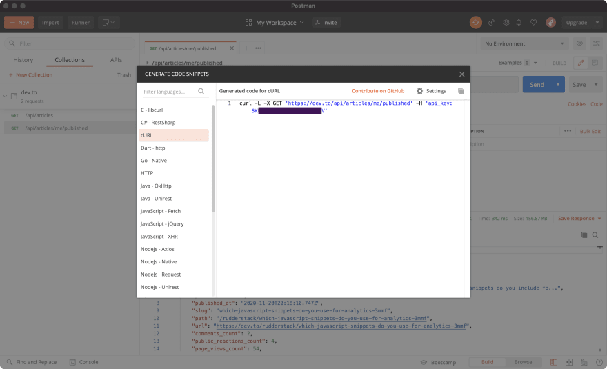

Now that you have your API callouts, the next hurdle is getting your data into your warehouse, in this example [Snowflake](https://www.snowflake.com/). There are multiple ways to go about getting your data from a REST API into Snowflake. The most common way would be to load via Snowpipe + AWS Lambda, as detailed [here](https://docs.snowflake.com/en/user-guide/data-load-snowpipe-rest-lambda.html). I said I could do this in less than 25 lines of code though, and a Lambda function would likely put me over that margin. Also, it’s more work than I really want to do.

Instead, I’ll load the data into a Google Sheet and automate hourly refreshes of that data with Google Apps Script. Then I’ll use RudderStack to collect and route the data in the Google Sheet to Snowflake on an hourly schedule.

### Load data into a Google Sheet
1. Create a new Google sheet.
2. Click on Tools > Script editor.
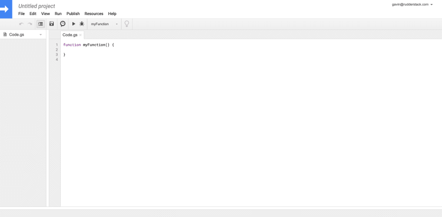
3. Name the project “dev.to API Import”.
4. Rename the file to “ImportJSON”.
5. Copy and paste the ImportJSON.gs code from the ImportJSON.gs file in [this repo](https://github.com/bradjasper/ImportJSON).
6. Because ImportJSON doesn’t work with API keys out-of-the-box, and we have to use one, add the following function below the `ImportJSONBasicAuth` function.
    ```
    /**
    * Helper function to authenticate with an API key using ImportJSONAdvanced
    *
    * Imports a JSON feed and returns the results to be inserted into a Google Spreadsheet. The JSON feed is flattened to create
    * a two-dimensional array. The first row contains the headers, with each column header indicating the path to that data in
    * the JSON feed. The remaining rows contain the data.
    *
    * The fetchOptions can be used to change how the JSON feed is retrieved. For instance, the "method" and "payload" options can be
    * set to pass a POST request with post parameters. For more information on the available parameters, see
    * https://developers.google.com/apps-script/reference/url-fetch/url-fetch-app .
    *
    * Use the include and transformation functions to determine what to include in the import and how to transform the data after it is
    * imported.
    *
    * @param {url}           the URL to a http basic auth protected JSON feed
    * @param {apiKey}  the API key value
    * @param {query}         the query passed to the include function (optional)
    * @param {parseOptions}  a comma-separated list of options that may alter processing of the data (optional)
    *
    * @return a two-dimensional array containing the data, with the first row containing headers
    * @customfunction
    **/
    function ImportJSONAPIKey(url, apiKey, query, parseOptions) {
    var header = {headers: {"api_key": apiKey}};
    return ImportJSONAdvanced(url, header, query, parseOptions, includeXPath_, defaultTransform_);
    }
    ```
    **Running Total: 5 lines of new code.**
7. Click File > Save.
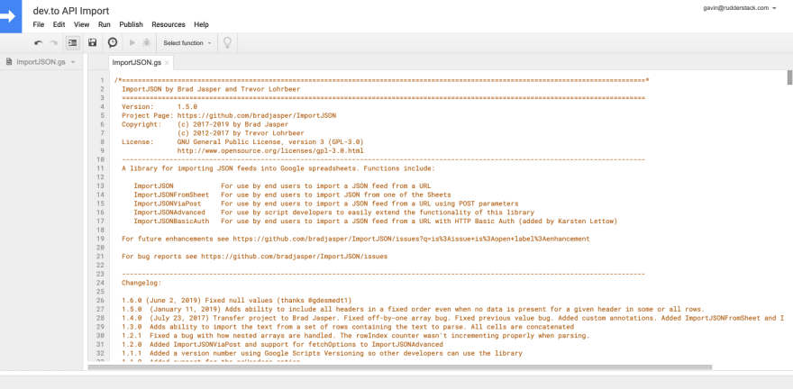
8. Go back to your Google Sheet, and in cell A1 use the ImportJSON function you just created with your `/articles` GET request you copied earlier. Here’s mine: `=ImportJSON("https://dev.to/api/articles?username=rudderstack&state=all", "/", "noTruncate")`.
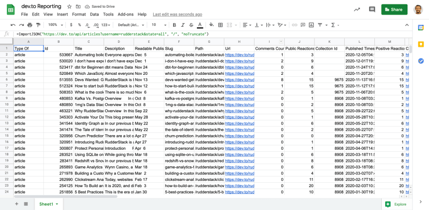
9. Rename the sheet “org-RudderStack”.
10. Add a sheet, and in cell A1 use the ImportJSONAPIKey function you created with your `/articles/me/published` GET request you copied earlier. Here’s mine: `=ImportJSONAPIKey("https://dev.to/api/articles/me/published", "[YOUR DEV.TO API KEY]", , "/id,/url,/page_views_count", "noTruncate")`.
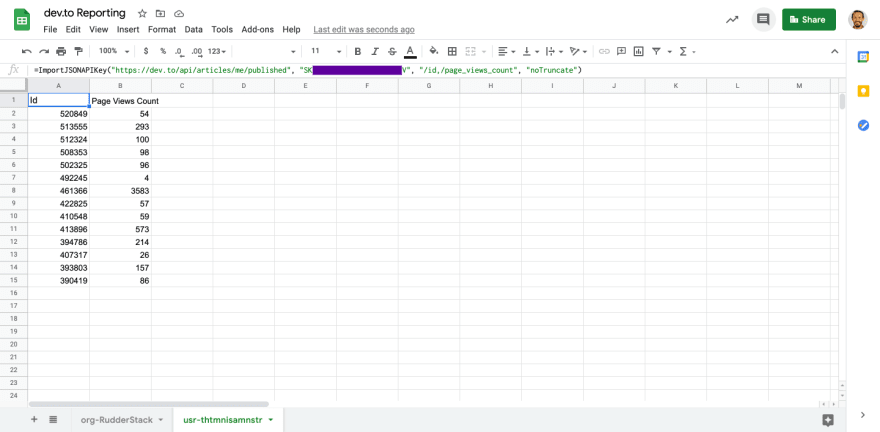
11. Rename the sheet “usr-thtmnisamnstr”.

### Automate hourly refreshes into your Google Sheet
1. Click on Tools > Script editor.
2. Click File > New > Script file.
3. Name the file “RefreshAllSheets” and click the “OK” button.
4. Copy and paste the following function into your file and save. \
    **Note:** I used Google’s documentation, [here](https://developers.google.com/apps-script/reference/spreadsheet), heavily in writing this.
    ```
    function refreshAllSheets() {
    // Get the current spreadsheet
    var spreadsheet = SpreadsheetApp.getActiveSpreadsheet();
    
    // Get an array of the sheets in the spreadsheet
    var sheets = spreadsheet.getSheets();
    
    // Get the active sheet (for resetting later)
    var activeSheet = spreadsheet.getActiveSheet();
    
    var i;
    for(i = 0; i < sheets.length; i++) {
        // Activate this sheet
        sheets[i].activate();
        
        // Set the active cell to A1
        var cell = sheets[i].getRange('A1');
        sheets[i].setCurrentCell(cell);
        
        // Copy the data and formula from the active cell
        var activeRange = sheets[i].getActiveRange();
        var activeCellValue = activeRange.getValue();
        var activeCellFormula = activeRange.getFormula();
        
        // Clear the active cell
        activeRange.clear();
        
        // Set the active cell's value and formula to the ones you copied
        activeRange.setValue(activeCellValue);
        activeRange.setFormula(activeCellFormula);
    }
    
    // Apply all pending changes
    SpreadsheetApp.flush();
    
    // Reset the active sheet
    spreadsheet.setActiveSheet(activeSheet);
    }
    ```
    **Running Total: 24 lines of new code.**
5. Now to schedule a daily refresh, go to [https://script.google.com/](https://script.google.com/).
6. Click on “My Projects”. Your “dev.to API Import” project should be there.
7. Hover over it, click the ellipses (three dots) on the right, and click “Project details”.
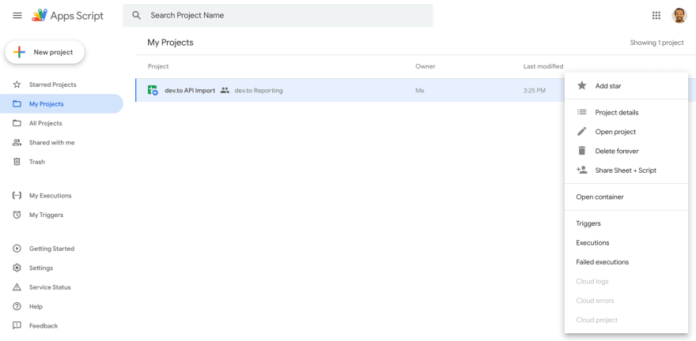
8. On the project details screen, click the ellipses on the right, and click “Triggers”.
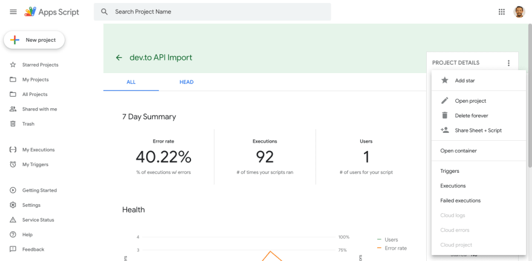
9. Click the “Add Trigger” button on the bottom-right.
    1. In the “Choose which function to run” drop-down, select “refreshAllSheets”.
    2. In the “Select event source” drop-down, select “Time-driven”.
    3. In the “Failure notification settings” drop-down, select “Notify me immediately”.

10. Click the “Save” button.

We now have a spreadsheet that will pull an update of our org’s dev.to post info, including performance metrics every hour.

## Setup your data warehouse and object storage
We use Snowflake for our data warehouse, so I’ll use Snowflake in this example. For more in-depth instructions, our [step-by-step guide to add Snowflake as a destination in RudderStack](https://docs.rudderstack.com/data-warehouse-integrations/snowflake) should help. 

### Create a warehouse
1. Login to Snowflake and click on the “Warehouses” icon in the top navigation.
2. Click the “Create” button. The Create Warehouse modal displays.
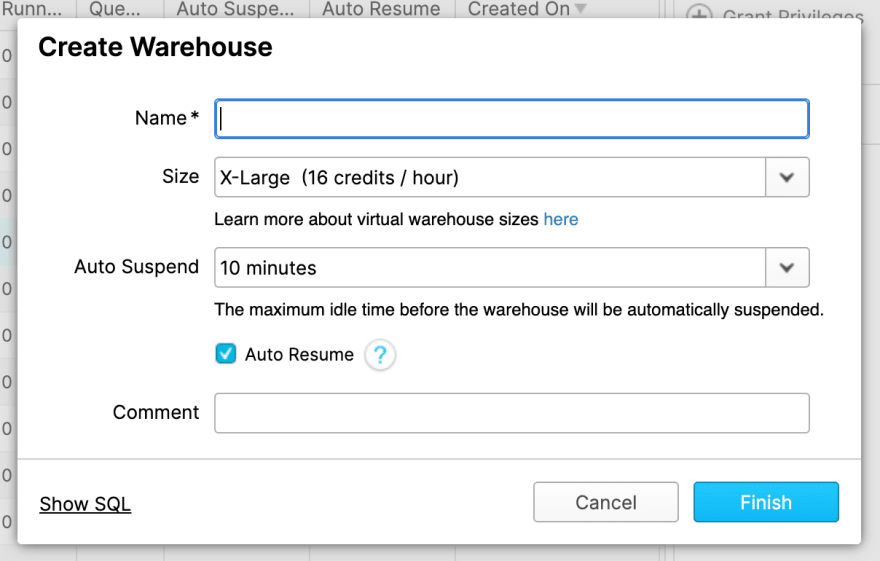
3. Enter a “Name” and set the size to “X-Small”. You can leave “Auto Suspend” and “Auto Resume” at their default values. Click the “Finish” button.

### Create a database
1. Click on the “Databases” icon in the top navigation.
2. Click the “Create” button. The Create Database modal displays.
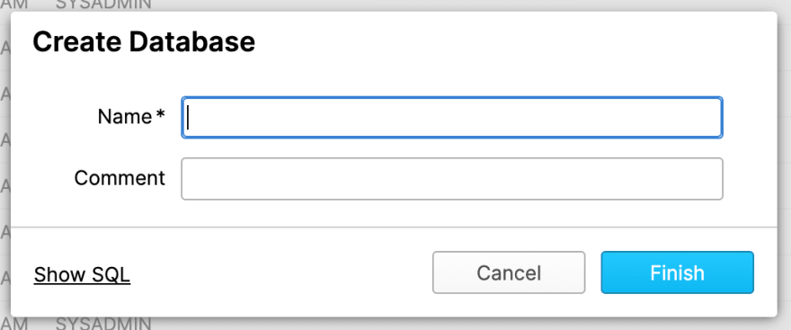
3. Enter a “Name”. Click the “Finish” button.

You now have a warehouse and database in Snowflake for your dev.to post data. You can configure a role and user if you want, see the step-by-step guide linked above for instructions. For my purposes, it’s not really necessary.

### Create object storage and get your Access Key
1. Login to AWS and go to the management console.
2. Expand the “All Services” accordion.
3. In the “Storage” section click on “S3”.
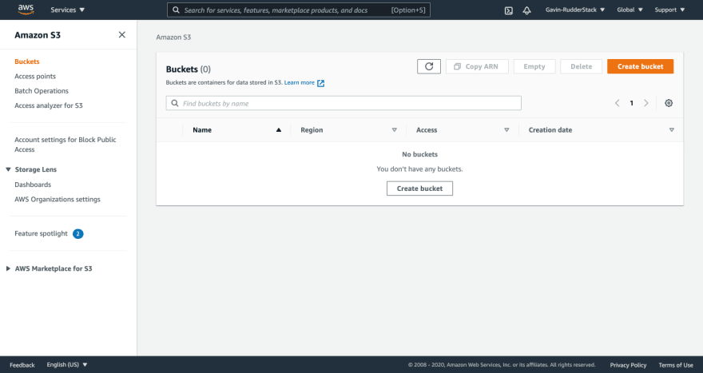
4. Click the “Create Bucket” button.
5. Name your bucket, choose your “Region”, and click the “Create Bucket” button. You should be able to leave everything else default. Keep a copy of your bucket name for use later.
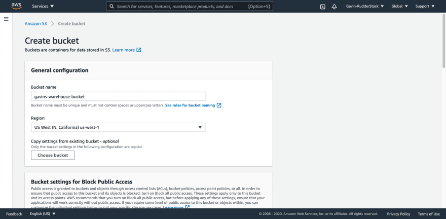
6. Click on your account name > “My Security Credentials” in the top navigation bar.
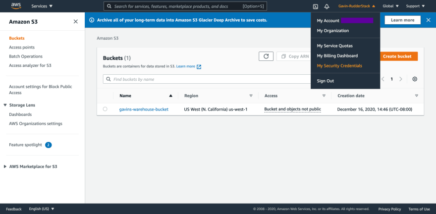
7. Expand the “Access Keys” accordion, and click the “Create New Access Key” button.
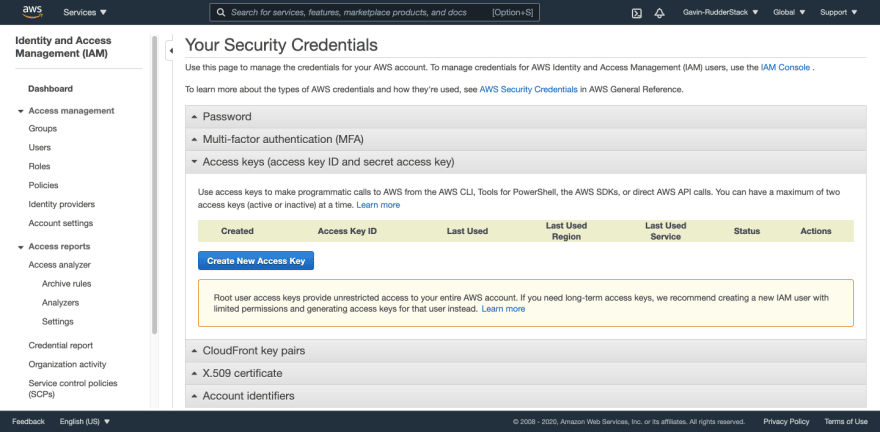
8. Keep a copy of your “Access Key ID” and “Secret Access Key” for later use.

## Create your data pipelines with RudderStack
### Configure your sources
1. Login to RudderStack, and click on “Sources” in the left navigation. This opens the Sources page.
2. Click the “Add Source” button. This opens the Choose Source page.
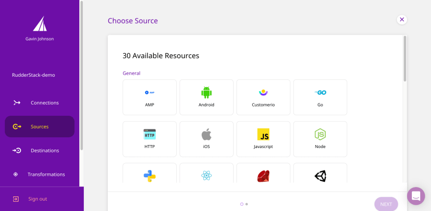
3. Scroll down to the “Cloud Sources” section, click on “Google Sheets”, and click the “Next” button.
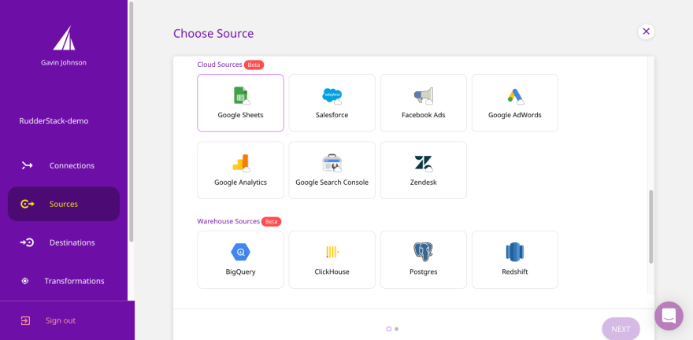
4. Name your source, and click the “Next” button.
5. Click “Connect with Google Sheets”, Login to your Google account and grant the necessary permissions. Click the “Next” button.
6. Configure the spreadsheet you want to pull data from and click the Next button.
    1. Select the spreadsheet you created earlier from the “Spreadsheet” drop-down menu.
    2. Select the appropriate worksheet from the “Worksheet” drop-down menu.
    3. For “Header row”, leave the default value of 1.
    4. For “First data row”, enter 2.
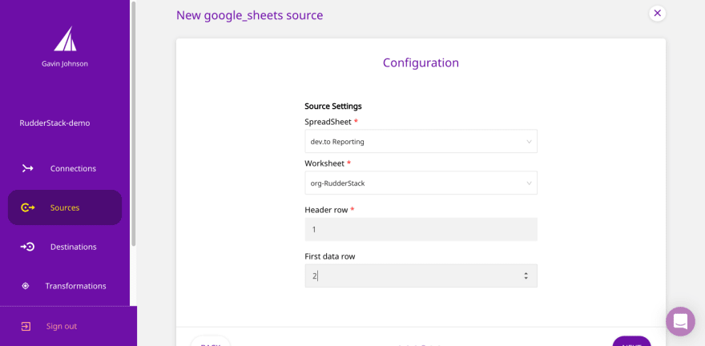
7. Configure your sync settings, and click the “Next” button. I set my “Run Frequency” to every 1 hour.
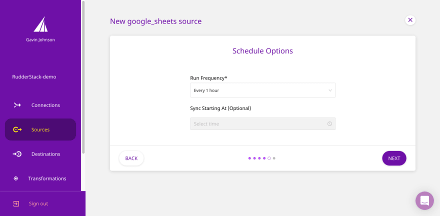
8. Repeat for each worksheet you need to pull data in from.

### Configure your destination
1. Click on “Destinations” in the left navigation. This opens the Destinations page.
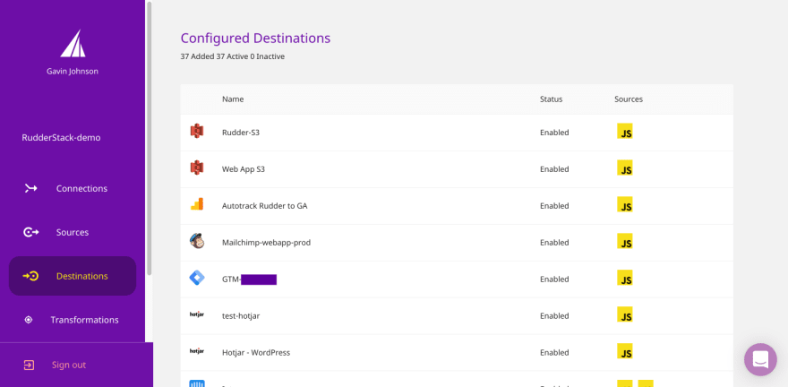
2. Scroll down to the “Destinations” section, click on Snowflake, and click the “Configure” button.

3. Name your destination, and click the “Next” button.
4. On the Connect Sources screen, select the Google Sheets source(s) you created previously, and click the “Next” button
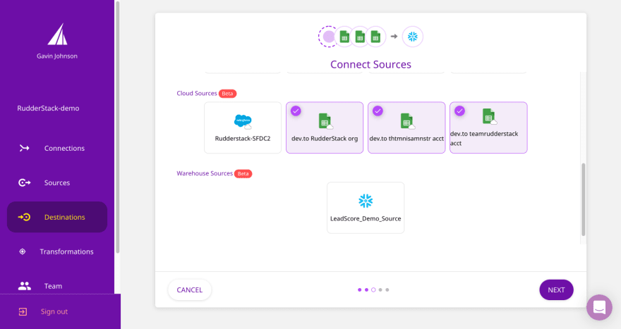
5. Enter your Snowflake connection credentials. Make sure to point to the warehouse and database you created earlier. Click the “Next” button.
    **Note:** Use the AWS S3 bucket and access key details from what you created earlier.

That’s it. You just built data pipelines that connect your dev.to reporting Google Sheet to Snowflake and update hourly. If you wait a few hours and go look at Snowflake, you’ll hourly activity on your data warehouse...
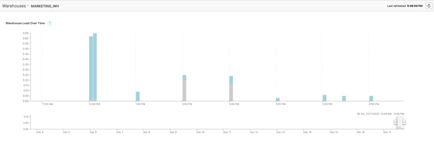
... tables where your data is stored ...
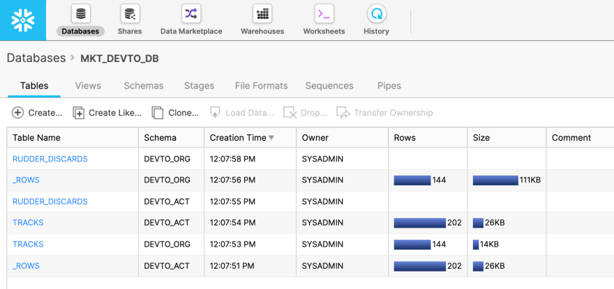
... and schemas for your dev.to data ...
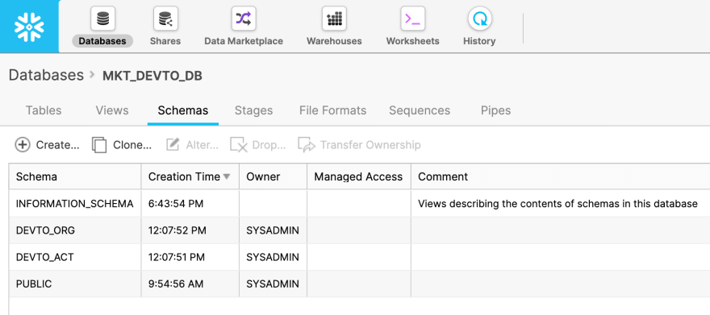

You can use BI tools like Looker to query and build visualizations for your dev.to reporting data. I’ll cover that topic in a future post.